# CSS анимации

- [Введение](README.md#user-content-Введение-)
- [Преобразования](README.md#user-content-Преобразования-)
    - [Перемещение](README.md#user-content-Перемещение-)
    - [Масштабирование](README.md#user-content-Масштабирование-)
    - [Вращение](README.md#user-content-Вращение-)
    - [Наклон](README.md#user-content-Наклон-)
    - [Множественные преобразования](README.md#user-content-Множественные-преобразования-)
    - [Исходная точка](README.md#user-content-Исходная-точка-)
    - [3D](README.md#user-content-3d-)
    - [Матрица преобразований](README.md#user-content-Матрица-преобразований-)
- [Переходы](README.md#user-content-Введение-)
    - [Поддерживаемые свойства](README.md#user-content-Поддерживаемые-свойства-)
    - ["Чудо-кнопка"](README.md#user-content-Чудо-кнопка-)
        - [Переход одного свойства](README.md#user-content-Переход-одного-свойства-)
        - [Переход нескольких свойств](README.md#user-content-Переход-нескольких-свойств-)
        - [Задержка перехода](README.md#user-content-Задержка-перехода-)
        - [Тип перехода](README.md#user-content-Тип-перехода-)
    - [Описание перехода](README.md#user-content-Описание-перехода-)
    - [Краткая запись](README.md#user-content-Краткая-запись-)
- [Анимация](README.md#user-content-Анимация-)
    - [Ключевые кадры](README.md#user-content-Ключевые-кадры-)
    - ["Чудо-попап"](README.md#user-content-Чудо-попап-)
        - [Два ключевых кадра](README.md#user-content-Два-ключевых-кадра-)
        - [Больше двух ключевых кадров](README.md#user-content-Больше-двух-ключевых-кадров-)
    - [Задержка анимации](README.md#user-content-Задержка-анимации-)
    - [Тип анимации](README.md#user-content-Тип-анимации-)
    - [Повторение анимации](README.md#user-content-Повторение-анимации-)
    - [Скачки между повторениями](README.md#user-content-Скачки-между-повторениями-)
    - [Скачки после завершения](README.md#user-content-Скачки-после-завершения-)
    - [Краткая запись](README.md#user-content-Краткая-запись-)
    - [Управление анимацией](README.md#user-content-Управление-анимацией-)
- [Использование в жизни](README.md#user-content-Использование-в-жизни-)
    - [Поддержка браузерами](README.md#user-content-Поддержка-браузерами-)
    - [Почему CSS предпочтительнее?](README.md#user-content-Почему-CSS-предпочтительнее-)
- [Ссылки](README.md#user-content-Ссылки-)

## Введение [⇡](README.md#user-content-css-анимации)

За весьма короткую историю Интернета у разработчиков было несколько вариантов добавления анимации на свои сайты.

Начиная с 1987 году разработчики могли добавить анимацию с помощью GIF изображения. Это самая простая и примитивная анимация в рамках одного изображения.

Программы Adobe Flash позволяли создавать сложную анимацию, включая игры и веб-приложения. Однако эту технологию необходимо изучать, она не позволяет взаимодействовать с другим HTML кодом на странице (будь то заголовок или абзац) и часто является источником угрозы безопасности сайта (это одна из причин, почему Apple отказались от Flash на iOS).

JavaScript позволяет анимировать все элементы на странице, но ценой изучения этого языка программирования.

Консорциум W3C осознал потребность разработчиков в удобном нативном инструменте для создания анимаций на странице и в спецификации CSS3 представил три модуля, реализующие эту возможность: CSS Transforms, CSS Transitions и CSS Animations. Сегодня мы можем перемещать, масштабировать, вращать и наклонять любые HTML-элементы на странице на чистом CSS.

## Преобразования [⇡](README.md#user-content-css-анимации)

Перед рассмотрением свойств, отвечающих непосредственно за анимацию, давайте познакомимся с возможностями CSS3, связанными с преобразованиями элементов.
На текущий момент нам доступны:
* Перемещение
* Масштабирование
* Вращение
* Наклон (перекашивание вдоль горизонтальной или вертикальной оси)

Преобразования позволяют слегка увеличивать пункт меню или элемент галереи при проходе над ним указателя мыши. Можно сочетать несколько преобразования и добиться по-настоящему выразительных эффектов.

Основным CSS свойством получения перечисленных преобразований является ```transform```. В качестве значения указывается тип и степень желаемого преобразования. Например, для увеличения элемента предоставляется ключевое слово ```scale```, далее в скобках указывается коэфициент увеличения: ```transform: scale(2)```;

Показанное объявление приведет к увеличению элемента в два раза.

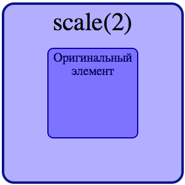

Преобразования обладают одним уникальным свойством - они не влияют на окружающие элементы. Сначала браузеры выделяют элементу то пространство, которое он занимал бы в потоке при обычных обстоятельствах (до преобразования), а затем занимаются преобразованием элемента.

Если мы поместим наш увеличивающийся в два раза элемент в один ряд с другими, то после увеличения он наложится на элементы, расположенные выше его, ниже или по бокам. Браузер сохраняет остальные части страницы в том виде, в котором они находились, если бы элемент не был увеличен.

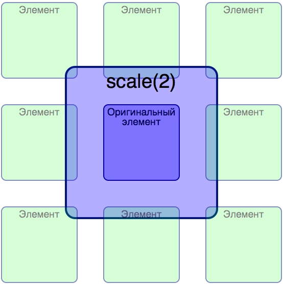

Рассмотрим подробнее все имеющиеся у нас в арсенале преобразования.

### Перемещение [⇡](README.md#user-content-css-анимации)

С помощью функции ```translate``` свойства ```transform``` мы можем перемещать элемент из его текущей позиции по системе координат влево/вправо и вверх/вниз. Как уже было сказано, преобразованный элемент не влияет на окружение и занимает на странице то пространство, которое он занимал бы, будучи показанный без преобразования.

Например, с помощью функции ```translate``` мы можем перенести изображение из текста вправо и вниз. Браузер оставляет пустое пространство там, где изображение отрисовалось бы при обычных обстоятельствах, а затем рисует элемент в его новой позиции. В результате такого перемещения на странице остается пустое место - незаполненное пространство между заголовком и параграфом текста.

Пример:

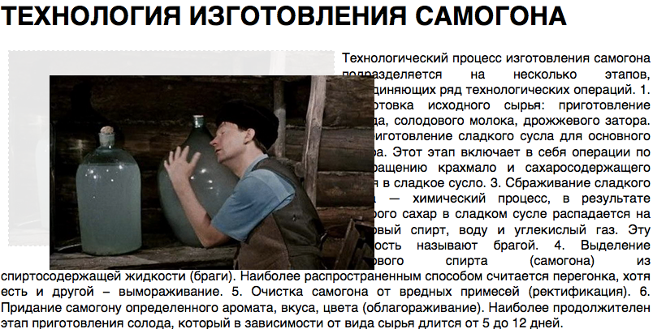

Вы можете заметить, что подобного эффекта можно добиться, используя абсолютное или относительное позиционирование, которое мы уже изучали. Вы будете правы. Однако, у перемещения с помощью transform есть свои преимущества - такие перемещения не вызывают лишних работ по отрисовке в браузере. Более подробно об этом в разделе [](Почему CSS предпочтительнее).

В функцию ```translate``` передается два аргумента. Первый определяет величину горизонтального, а второй - вертикального перемещения. В следующем примере щелчок по кнопке с классом .button вызовет смещение элемента на 10 пикселей вправо и 10 пикселей вниз.

```
.button:active {
    transform: translate(10px, 10px);
}
```

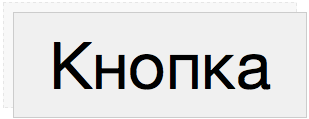

Если необходимо переместить элемент влево или вверх, то следует использовать отрицательные значения.

```
.button:active {
    transform: translate(-10px, -10px);
}
```

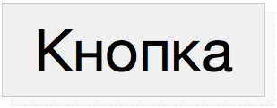

Функция translate может перемещать элемент на указанное количество px, em или %. В качестве единиц измерения подойдут любые значения, указывающие длину в CSS. Следует обратить внимание, что значение перемещения, указанное в процентах, вычисляется от текущих размеров элемента. Зачастую, эта особенность используется для выравнивания элемента произвольных размеров по центру.

В CSS3 также имеются две дополнительные функции для горизонтального - ```translateX``` и вертикального перемещения - ```translateY```.

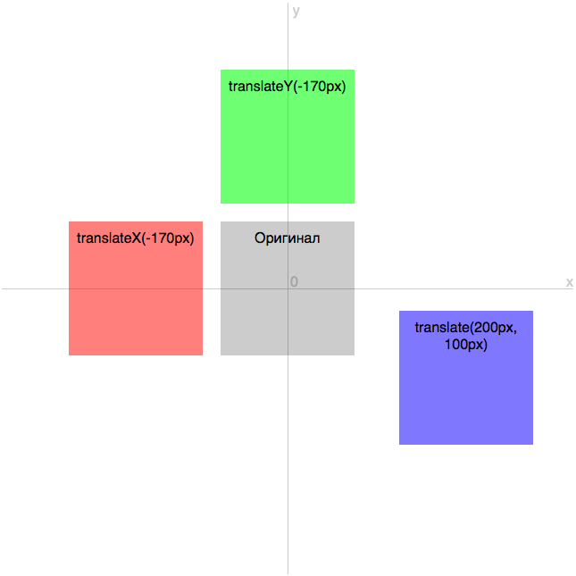

### Масштабирование [⇡](README.md#user-content-css-анимации)

Функция ```scale```, действие которой мы уже наблюдали выше, позволяет увеличить или уменьшить элемент в размерах.
Если мы хотим увеличить элемент в полтора или два раза, нам следует добавить следующие объявления:

```
.biceps_x15 {
    transform: scale(1.5);
}

.biceps_x2 {
    transform: scale(2);
}
```

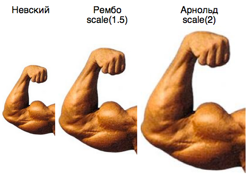

Как уже упоминалось выше, увеличенный в размерах элемент не двигает другие элементы со своего пути. В действительности, он, скорее всего, перекроет соседние элементы (смотрите пример #2)

Пока что мы передавали в функцию ```scale``` один параметр - коэфициент масштабирования. Это число, на которое умножаются текущие размеры элемента. Передав число 1 мы никак не изменим элемент (масштабирование отсутствует). Передав 0.5 мы уменьшим элемент вдвове, а 4 - увеличим в четыре раза.

Таким образом числа между 0...1 приводят к уменьшению элемента, а числа больше 1 - к увеличению. С помощью ```scale(0)``` можно, фактически, скрыть элемент на странице.

При изменении размеров элемента увеличивается или уменьшается как сам элемент, так и все его содержимое, включая текст, изображения, вложенные элементы.

Функция scale может принимать два параметра. В таком случае первое число будет относиться к горизонтальному, а второе - к вертикальному масштабированию.

Например, мы можем уменьшить элемент вдвое по ширине и увеличить вдвое по высоте. В таком случае нам потребуется следующее объявление:

```
.uncle_stepan {
    transform: scale(.5, 2);
}
```

в CSS3 имеются дополнительные функции для горизонтального и вертикального масштабирования - ```scaleX``` и ```scaleY``` соответственно.

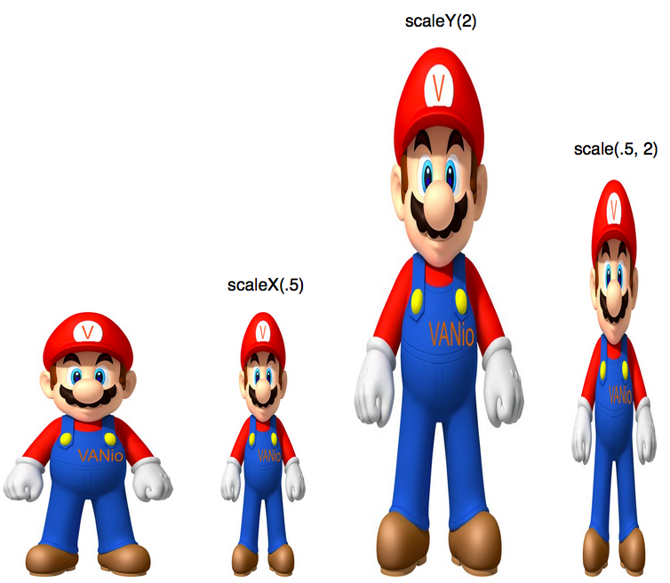

Что будет, если применить к функции scale отрицательные значения? Мы получим интересный визуальный эффект поворота элемента вокруг его горизонтальной или вертикальной оси. Чтобы повернуть элемент вокруг обоих его осей, необходимо использовать объявление ```scale(-1)```. ```scale(-1, 1)``` поворачивает элемент вокруг его вертикальной оси, а ```scale(1, -1)``` вокруг горизонтальной.

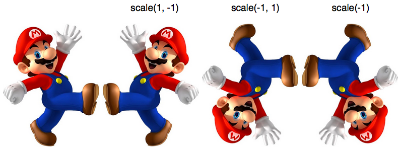

### Вращение [⇡](README.md#user-content-css-анимации)

Функция ```rotate``` позволяет вращать элемент на указанное количество градусов. Чтобы задать значения угла используется число, за которым следует единица измерения ```deg```. Чтобы повернуть элемент на 180 градусов, нам потребуется следующее объявление:

```
.dislike {
    transform: rotate(180deg);
}
```

Отрицательное значение угла вращает элемент против часовой стрелки. Значение ```0deg``` не придает вращение. Значения, кратные 360, вращают элемент на полные обороты и внешне это выглядит как отсутствие вращения. Однако, использование таких значений оправдано, например, для создания анимации вращения кнопки на один или несколько оборотов во время проведении указателя мыши над кнопкой.

```
.go-away {
    transform: rotate(90deg);
}

.taxi {
    transform: rotate(-30deg);
}
```

Помимо градусов (```deg```, полный круг равен ```360deg```), можно использовать другие единицы измерения: ```grad``` (полный круг ```400grad```), ```rad``` (полный круг ```6.2832rad```) и ```turn``` (равен одному повороту).


В CSS3 есть дополнительные функции для вращения элемента относительно осей X и Y: ```rotateX()``` и ```rotateY()```. С помощью них можно создавать эффекты флип-вращения: http://codepen.io/mrsamo/full/xwmZdz/

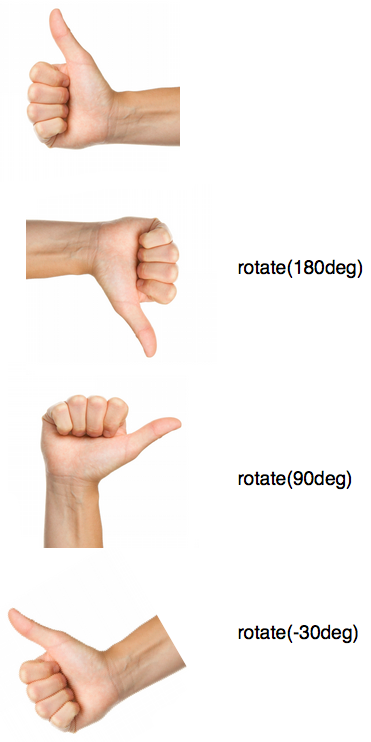

### Наклон [⇡](README.md#user-content-css-анимации)

Наклон элемента можно выполнить по горизонтальной и вертикальной осям. Чтобы наклонить все вертикальные линии элемента на 45 градусов влево (против часовой стрелки) нам потребуется следующее объявление:

```
.skew_45_0 {
    transform: skew(45deg, 0);
}
```

Для наклона всех горизонтальных линий на 45 градусов по часовой стрелке нам потребуется объявление:

```
.skew_0_45 {
    transform: skew(0, 45deg);
}
```

Мы также можем наклонить элемент по двум осям одновременно. Применим наклон на 25 градусов для вертикальных и горизонтальной линий с помощью объявления:
```
.skew_25 {
    transform: skew(25deg, 25deg);
}
```

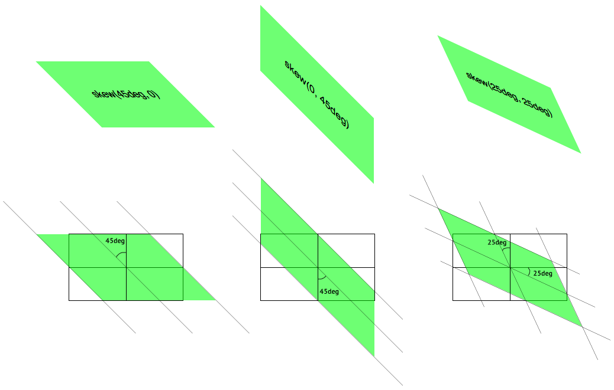

Как и в случае с ```translate``` и ```scale```, в CSS3 предлагаются отдельные функции для осей X и Y: ```skewX``` и ```skewY```.

### Множественные преобразования [⇡](README.md#user-content-css-анимации)

Мы рассмотрели 4 доступных в CSS3 вида преобразований. До сих пор в качестве значения свойства ```transform``` мы указывали только одну функцию. Но мы не ограничены одним видом преобразования, мы можем одновременно вращать, наклонять, передвигать и масштабировать элемент.
Нужно просто добавить дополнительные функции к свойству ```transform``` через пробел. Мы можем увеличить элемент в два раза и повернуть на 180 градусов с помощью объявления:
```
.scale_rotate {
    transform: scale(2) rotate(180deg);
}
```

Следующее объявление применит все 4 вида преобразования к элементу:
```
.all_of_them {
    transform: scale(1.5) skew(45deg, 0) translate(100px, 200px) rotate(180deg);
}
```

Браузер применит все функции к элементу в том порядке, в котором они были перечислены. Порядок играет роль, если вы используете наклон и вращение. Дело в том, что данные функции наклоняют и вращают не только сам элемент, но и систему координат. Например, мы можем повернуть элемент на 90 градусов, тем самым поменять оси местами. После такого вращение функции перемещения и наклона будут работать относительно новой, преобразованной, системы координат.

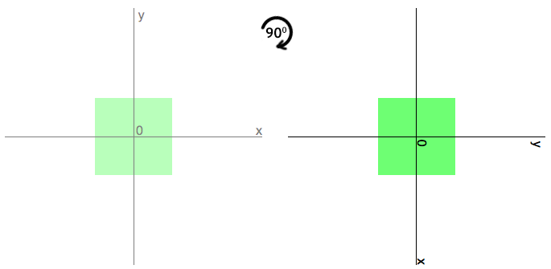

Для примера выше справедливо: ```translateX(100px)``` преместит элемент вниз, а не право и сработает, фактически, как ```translateY(100px)``` для первоначального элемента, к которому не применялось вращение. Для лучшего понимания работы преобразований после изменения системы координат рассмотрим следующее объявление:
```
.rotate_translate_skew {
    transform: rotate(45deg) skew(20deg, 0) translate(200px, 100px);
}
```

Пошагово покажем, как ведет себя элемент и система координат после каждого преобразования. Элемент до преобразования:

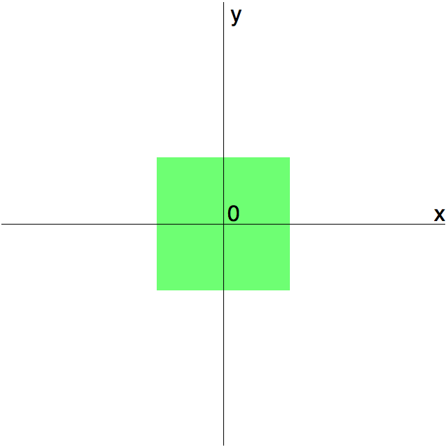

В первую очередь браузер займется вращением элемента на 45 градусов по часовой стрелке.

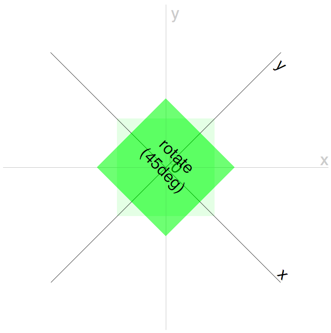

После вращения будет повернута и система координат и наклон будет выполнен уже на новой системе.

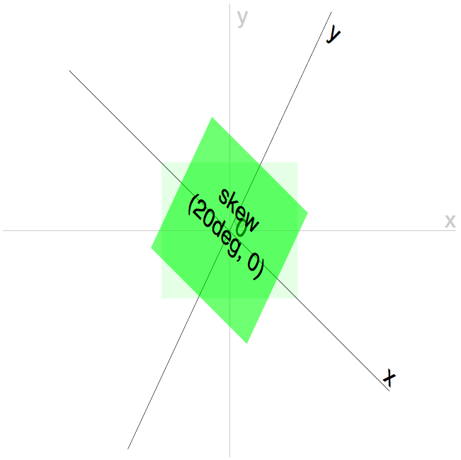

Последнее преобразование, перемещение, выполняется на системе координат, полученной после вращения и наклона. Само перемещение никак не влияет на систему координат.

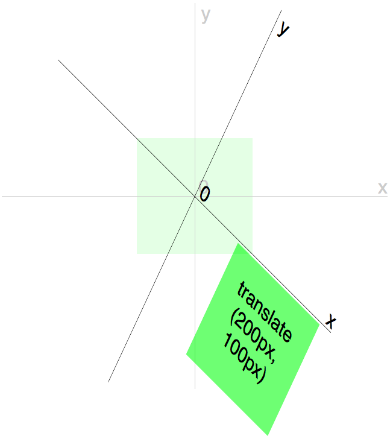

Если мы применим свойства в другом порядке, то получим совершенно иную картину.
```
.translate_skew_rotate {
    transform: translate(200px, 100px) skew(20deg, 0) rotate(45deg);
}
```


Будьте внимательны при использовании множественных преобразований.

### Исходная точка [⇡](README.md#user-content-css-анимации)

Все преобразования браузер выполняет относительно точки, которая по умолчанию находится в центре элемента. Однако, эту точку можно двигать с помощью свойства ```transform-origin```. Это свойство работает так же, как и свойство ```background-position```. В качестве значения принимает ключевые слова, абсолютные или относительные единицы измерения (em, %).

Давайте повернем элемент относительно его левой верхней точки, используя объявление:
```
.rotate_lt {
    transform: rotate(45deg);
    transform-origin: left top;
}
```

или
```
.rotate_lt {
    transform: rotate(45deg);
    transform-origin: 0 0;
}
```

или
```
.rotate_lt {
    transform: rotate(45deg);
    transform-origin: 0% 0%;
}
```

Чтобы повернуть элемент относительно центральной нижней точки, используем объявление:
```
.rotate_cb {
    transform: rotate(45deg);
    transform-origin: center bottom;
}
```

или
```
.rotate_cb {
    transform: rotate(45deg);
    transform-origin: 50% 100%;
}
```

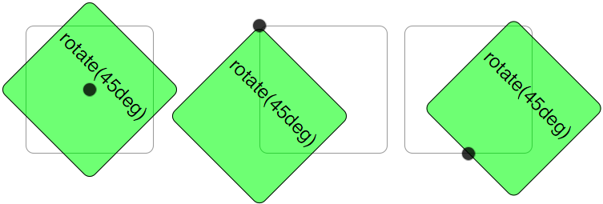

Как вы уже заметили, мы передаваем два аргумента через пробел: первое значение отвечает за горизонтальную, а второе - за вертикальную позицию.

Свойство ```transform-origin``` не влияет на элементы, которые подвергаются только перемещению с помощью функции ```translate```.

### 3D [⇡](README.md#user-content-css-анимации)

Пока что мы рассматривали преобразования, которые применялись в двумерном пространстве - системе координат XY. В CSS3 есть возможность имитировать трехмерное пространство на плоском экране монитора, используя трехмерные преобразования (```3D transform```).

Модель 3D трансформаций CSS3 является логическим продолжением модели 2D трансформаций, но с одним важным дополнением - наличием перспективы. Перспектива создает иллюзию глубины и позволяет перемещать в двумерном пространстве экрана точку вдоль и вокруг оси Z (как бы вглубь экрана и из него).

Если вы занимались рисованием, то, возможно, слышали о перспективе. Перспектива позволяет создать иллюзию трехмерного пространства, когда у вас в наличие только двумерное. Сначала вы берете точку в плоскости, которая называется "точкой схождения линий". Далее вы рисуете линии от этой точки до краев вашей плоскости. В дальнейшем эти линии определят относительный размер всех объектов, которые вы планируете нарисовать, создавая у смотрящего иллюзию глубины и расстояния до объекта.

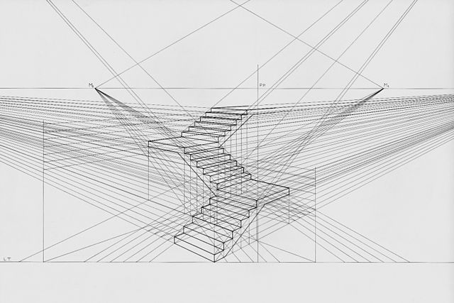

3D преобразования работают похожим образом. В качестве плоскости у нас система координат, и тогда точкой схождения линий будет точка ***0*** на этой системе, а точнее точка ***(0,0,0)***, где все значения на осях X, Y и Z равны 0.

Мы можем управлять расстоянием от точки просмотра до трансформируемого элемента. Для это есть свойство ```perspective```. Уменьшая значение перспективы, мы добавляем глубину элементу (увеличиваем его размеры по оси Z). Сам элемент при этом становится визуально меньше. Чем меньше значение, тем ближе Z-пространство к зрителю и тем больше эффект, заданный с помощью свойства ```transform```. Свойство ```perspective``` действует только на дочерние элементы, сам элемент не получает "перспективный" вид. Если единица измерения не указана, по умолчанию она считается в px.

Возможно, все это звучит сложно, но на деле это не так.

```
.3d_perspective_200 {
    perspective: 200px;
}
.3d_perspective_400 {
    perspective: 400px;
}
.3d_perspective_600 {
    perspective: 600px;
}
.3d_perspective_800 {
    perspective: 800px;
}
```

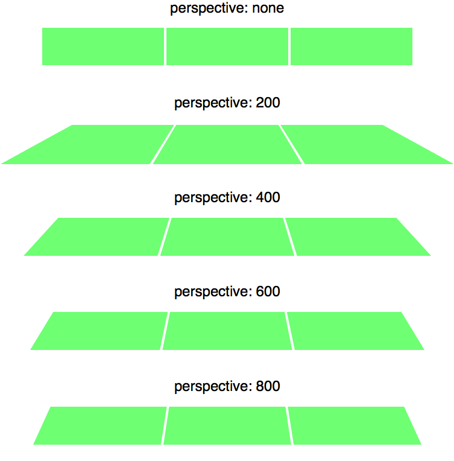

Помимо удаленности, мы можем изменять расположение точки обзора. Для этого в CSS3 имеется свойство ```perspective-origin```. Свойство работает только с заданным свойством ```perspective```, отличным от нуля. Аналогично ```background-position``` и ```transform-origin``` в качестве значения принимаются ключевые слова, абсолютные или относительные единицы измерения (em, %).

Во всех следующих примерах значение перспективы равно 400.
```
.3d_perspective {
    /* по-умолчанию: perspective-origin: 50% 50%; */
}
.3d_perspective_lt {
    perspective-origin: 0 0;
}
.3d_perspective_ct {
    perspective-origin: 50% 0%;
}
.3d_perspective_rt {
    perspective-origin: right top;
}
```

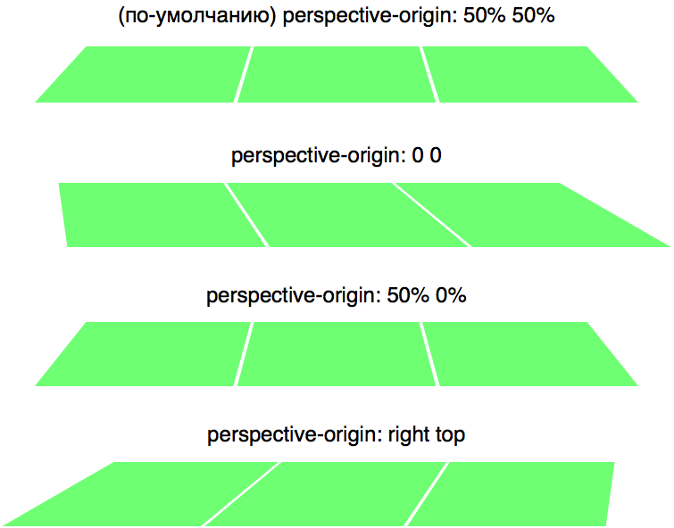

По умолчанию все трехмерные преобразования работают в двумерной системе координат (X и Y) и не имеют глубины (Z). Для имитации глубины необходимо явно изменить это поведение. Сделать это можно с помощью свойства ```transform-style```, выставив ему значение ```preserve-3d```. По умолчанию установлено второе допустимое значение - ```flat```.

Реализуем три элемента: первый выдвинем по оси Z на нас (из экрана), второй оставим в плоскости экрана, а третий отодвинем от нас (в глубь экрана). Родительский элемент также немного повернем. Если оставить значение по умолчанию, то мы не увидим глубины картины. В отличие от этого, значение ```preserve-3d``` создаст псевдо-глубину.

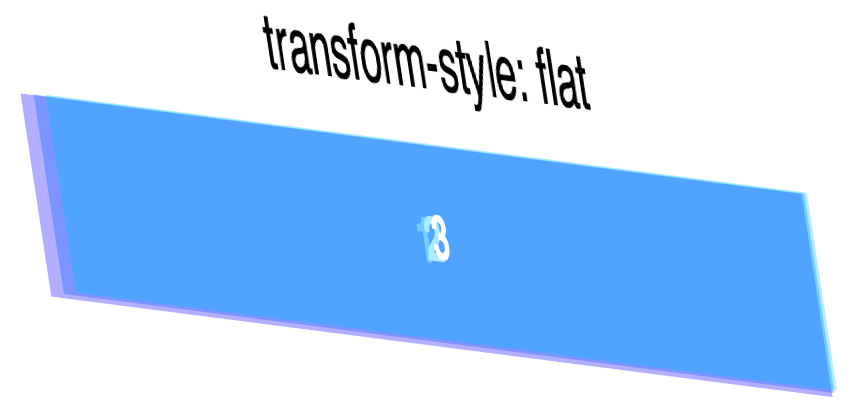

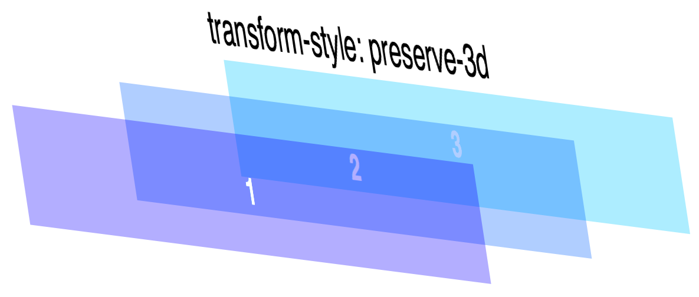

Также стоит упомянуть о свойстве ```backface-visibility```, которое контролирует видимость задней части элемента, когда он повернут. Значение ```hidden``` отменяет видимость по умолчанию и скрывает обратную сторону преобразованного элемента.

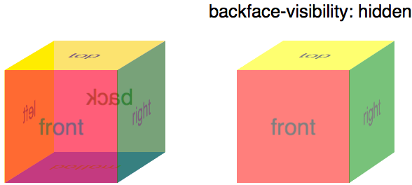

Все функции преобразования, кроме наклона, имеют аналоги в 3D трансформациях: ```translate3d(x,y,z)```, ```translateZ(z)```, ```scale3d(x,y,z)```, ```scaleZ(z)```, ```rotate3d(x,y,z,угол)```, ```rotateZ(угол)```.

[Пример работы всех 3D функций](http://codepen.io/mrsamo/pen/avXWxe)

### Матрица преобразований [⇡](README.md#user-content-css-анимации)

Помимо четырех функций преобразования: ```translate```, ```scale```, ```rotate``` и ```skew``` CSS3 позволяет самостоятельно описать трансформацию с помощью матрицы преобразования. В данном случае имеется ограничение - все линии остаются параллельными, таким образом нельзя описать перспективу с помощью матрицы.

Матрицы имеет размер 3х3.

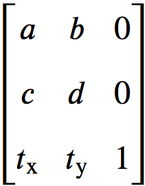

Иногда третью колонку опускают, так как она не влияет на конечный результат.

Чтобы рассчитать новые координаты элемента после применения матрицы трансформации, браузер использует следующие формулы:

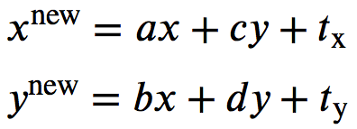

Роль каждого коэфициента описана в таблице ниже.

Коэффициент|Преобразование|Аналог
---------- | --------- | ---------
a|Изменение размера по горизонтали|scaleX()
b|Наклон по горизонтали|skewX()
c|Наклон по вертикали|skewY()
d|Изменение размера по вертикали|scaleY()
tx|Смещение по горизонтали в пикселах|translateX()
ty|Смещение по вертикали в пикселах|translateY()

Матрица задается с помощью ключевого слова ```matrix``` свойства ```transform```. В функцию ```matrix``` передаются аргументы - коэфициенты матрицы преобразования.
```
.matrix {
    transform: matrix(a, c, b, d, tx, ty);
}
```

Порядок перечисления коэфициентов имеет принципиальное значение.

Давайте воспроизведем функцию ```scaleX(2)``` с помощью матрицы преобразования. Для увеличения элемента по горизонтали в два раза, коэфициент ```a``` приравниваем к 2, а остальные коэфициенты делаем как в единичной матрице (матрица с нулевыми коэфициентами и единицами по диагонали).

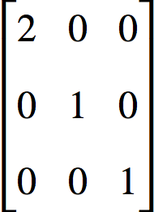

Вычисляем по формулам новые координаты элемента:

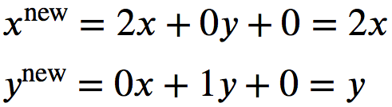

Координата x элемента после преобразования в два раза больше оригинальной, чего мы и добивались.
```
.scale_2x {
    transform: matrix(2, 0, 0, 1, 0, 0);
}
```

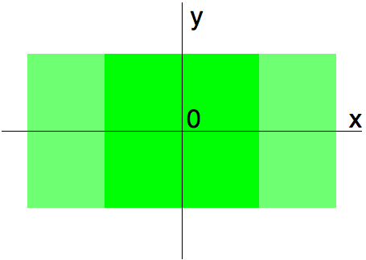

Для описания 3D преобразований используется матрица 4х4 и ключевое слово ```matrix3d``` свойства ```transform```. Подробнее об этом вы можете прочитать тут - https://dev.opera.com/articles/ru/understanding-the-css-transforms-matrix/.

## Переходы [⇡](README.md#user-content-css-анимации)

Преобразования позволяют создавать забавные эффекты, но по-настоящему оживить страницу они могут в сочетании с CSS3 переходами.

Переход - это анимация от одного набора CSS свойств к другому. Для работы перехода необходимо:

1. ***Два набора свойств***. Первый набор описывает начальное состояние элемента (например, ```color: red```), а второй - конечное (```color: blue```). Процессом анимации от одного набора к другому (переход цвета от красного до синего) занимается браузер.
2. ***Свойство ```transition```***. Краеугольный камень перехода - описание свойств и характеристик анимации перехода. Как правило, применяется к исходному набору свойств.
3. ***Инициатор***. Действие, которое вызывает изменение от одного набора свойств к другому. Часто в качестве инициатора используются псевдоклассы ```:hover```, ```:target```, ```:focus```, ```:active```. Например, с помощью :hover можно анимировать изменение внешнего вида элемента от первоначального появления на странице до проведения над элементом указателя мыши.
Конечно, в качестве инициатора может выступать JavaScript: применение инлайновых стилей к элементу или добавление класса с новым набором CSS свойств.
После пропадания иницатора (пользователь увел указатель мыши с элемента) браузер возвращает внешний вид элемента к первоначальному и анимирует этот процесс.

Вам необходимо единожды установить переход в CSS, а все хлопоты по созданию анимации от одного набора свойств к другому и обратно браузер возьмет на себя.

### Поддерживаемые свойства [⇡](README.md#user-content-css-анимации)

Браузер не может анимировать переходы для всех CSS свойств, но в нашем арсенале есть линый список свойств, с которыми переходы работают:
* все преобразования: ```translate```, ```rotate```, ```scale```, ```skew```)
* ```color```, ```background-color```, ```border-color```
* ```width```, ```height```, ```border-width```, ```margin```, ```padding```
* ```font-size```, ```line-height```, ```letter-spacing```, ```word-spacing```
* ```top```, ```right```, ```bottom```, ```left```
* opacity

Полный список свойств можно найти по адресу: http://www.w3.org/TR/css3-transitions/#animatable-properties

### Создание перехода [⇡](README.md#user-content-css-анимации)

В основе CSS перехода лежат 4 свойства:

Свойство|Отвечает за
------- | -------
transition-property|Какие свойства анимировать
transition-duration|Сколько времени длится анимация
transition-timing-function|Какой тип анимации будет использован
transition-delay|Необязательная задержка в начале анимации

### «Чудо-кнопка» [⇡](README.md#user-content-css-анимации)

Рассмотрим все свойства, связанные с созданием перехода на примере кнопки, которая становится чуть заметнее на фоне остальных во время прохода указателя мыши над ней.
На псевдокласс ```:hover``` мы будем увеличивать размер кнопки с помощью уже известного свойства ```transform: scale```.

#### Переход одного свойства [⇡](README.md#user-content-css-анимации)

Начнем с задания двух наборов свойств - для первоначального вида кнопки и вида при проходе над кнопкой указателем мыши.
```
.button {
    ...оформление кнопки...
}
.button:hover {
    transform: scale(1.2);
}
```

Эти стили работают мгновенно, кнопка увеличивается в 1.2 раза моментально при проходе курсора мышки над кнопкой.

[Пример](http://codepen.io/mrsamo/pen/jbXxKy)

Чтобы масштаб изменился плавно и анимация изменения длилась половину секунды, нужно к стилю кнопки добавить два новых свойства:
```
.button {
    transition-property: transform;
    transition-duration: .5s;
}
.button:hover {
    transform: scale(1.2);
}
```

[Пример](http://codepen.io/mrsamo/pen/jbXxKy)

В ```transition-property``` мы указали анимируемое свойство, а в ```transition-duration``` - время, в течение которого будет осуществляться анимация.

#### Переход нескольких свойств [⇡](README.md#user-content-css-анимации)

В качестве значения для ```transition-property``` можно указывать не конкретное анимируемое свойство, а:
* ключевое слово ```all``` (в таком случае будут анимироваться все изменяемые CSS войства)
* список анимируемых свойств через запятую (```transition: width, height, ...```)

Свойство ```transition-duration``` принимает значение в секундах или миллисекундах (```transition-duration: .5s``` эквивалетно ```transition-duration: 500ms```).
Если в ```transition-property``` указано несколько CSS свойств, в ```transition-duration``` есть возможность задать продолжительность анимации для каждого свойства отдельно. Для этого надо перечислить значения через запятую. Порядок перечисления продолжительности анимации совпадает с порядком следования анимируемых свойств.

Добавим изменение цвета фона для нашей кнопки с той же продолжительностью, что и масштаб.

```
.button {
    background-color: green;
    transition-property: transform, background-color;
    transition-duration: .5s, .5s;
}
.button:hover {
    transform: scale(1.2);
    background-color: blue;
}
```

#### Задержка перехода [⇡](README.md#user-content-css-анимации)

Можно задержать время начала анимации перехода, воспользовавшись свойством ```transition-delay```. Например, если мы хотим подождать полсекунды, прежде чем начать анимацию фона, можно добавить следующий код:
```
.button {
background-color: green;
    transition-property: transform, background-color;
    transition-duration: .5s, .5s;
    transition-delay: 0s, 1s;
}
.button:hover {
    transform: scale(1.2);
    background-color: blue;
}
```

[Пример](http://codepen.io/mrsamo/pen/jbXxKy)

Теперь при проходе указателя мыши над кнопко сначала плавно увеличивается масштаб кнопки, а после окончания этой анимации плавно изменяется цвет фона. Аналогично ```transition-duration```, для каждого свойства можно указать свое время задержки. Порядок перечисления показателей времени задержки должен соответствовать порядку перечисления этих свойств в ```transition-property```.

#### Тип перехода [⇡](README.md#user-content-css-анимации)

И последнее свойство, описывающее CSS переход - это ```transition-timing-function```. Это свойство описывает скорость хода анимации. В его предназначении легко запутаться: в отличие от ```transition-duration```, которое управляет продолжительностью анимации, ```transition-timing-function``` описывает, как быстро по времени меняется указанное через ```transition-property``` значение свойства. Например, мы можем начать изменение свойства быстро в начале и медленно в конце, или наоборот.

В качестве значений для данного свойства есть 8 ключевых слов: ```linear```, ```ease```, ```ease-in```, ```ease-out```, ```ease-in-out```, ```step-start```, ```step-end``` и ```step```. По умолчанию используется метод ```ease```, при котором анимация начинается медленно, ускоряется к середине и снова змедляется в конце. Используя разные методы можно варьировать общий вид анимации. По [ссылке]() вы можете посмотреть одну и ту же анимацию, которая совершается с разным ходом.

Значение|Ход анимации
------- | -------
ease|Медленное начало, ускорение к середине и замедление к завершению
ease-in|Медленное начало, ускорение к завершению
ease-out|Быстрое начало, замедление к завершению
ease-in-out|Медленное начало и завершение
linear|Непрерывная одинаковая скорость от начала до конца
step-start|Моментальный переход к конечным значениям (анимации нет)
step-end|Сохранение начальных значений заданное время, затем моментальный переход к конечным значениям (анимаиции нет)
steps|Ступенчатая функция, steps(<число>, start \| end), изменение свойств скачками за указанное число шагов
cubic-bezier|Функция движения в виде кривой Безье (читайте дальше)

Давайте изменим стандартный метод ```ease``` для нашей чудо-кнопки на ```ease-in```, чтобы наши анимации начинались медленно и ускорялись к завершению.

```
.button {
    background-color: green;
    transition-property: transform, background-color;
    transition-duration: .5s, .5s;
    transition-delay: 0s, 1s;
    transition-timing-function: ease-in, ease-in;
}
.button:hover {
    transform: scale(1.2);
    background-color: blue;
}
```

[Пример](http://codepen.io/mrsamo/pen/jbXxKy)


Учитывая повторяющиеся значения для анимируемых CSS свойств, мы можем сократить нашу запись.
```
.button {
    background-color: green;
    transition-property: transform, background-color;
    transition-duration: .5s;
    transition-delay: 0s, 1s;
    transition-timing-function: ease-in;
}
.button:hover {
    transform: scale(1.2);
    background-color: blue;
}
```

Помимо ключевых слов, свойство ```transition-timing``` может принимать [кубическую кривую Безье](https://ru.wikipedia.org/wiki/%D0%9A%D1%80%D0%B8%D0%B2%D0%B0%D1%8F_%D0%91%D0%B5%D0%B7%D1%8C%D0%B5). Эта кривая описывает график хода анимации по времени. Кривизной линии можно управлять путем настройки двух контрольных точек: чем круче линия, тем быстрее анимация, а более пологая линия означает более медленный ход анимации. Для создания и тестирования различных функций распределения скорости хода анимации можно воспользоваться прекрасным инструментом от Мэтью Лейнома - [Ceasar](http://matthewlein.com/ceaser/).

На самом деле, все ключевые слова (```linear```, ```ease```, ```ease-in```, ```ease-out``` и ```ease-in-out```) - это частные и наиболее популярные кривые. Например, метод ```ease-in``` можно задать и с помощью кубической кривой Безье:
```
.button {
    ...
    transition-timing-function: cubic-bezier(0.420, 0.000, 1.000, 1.000);
}
```

С помощью кривых Безье вы можете добиться крайне интересных эффектов в ваших анимациях.
Более подробно о временных функциях можно узнать в статье: [CSS 3 Timing Functions и с чем их едят](http://habrahabr.ru/post/220715/).

### Краткая запись [⇡](README.md#user-content-css-анимации)

Думаю, вы обратили внимание, как раздулся наш CSS код под конец предыдущей части. Указание всех 4х свойств, описывающих переход, занимает достаточно много места. К счастью, мы можем использовать лишь одно свойство ```transition``` для описания перехода. Это свойство объединяет все вышеперечисленные в одно.
Для этого нужно перечислить через пробел:
* transition-property
* transition-duration
* transition-delay
* transition-timing-function

Например, следующие объявления эквиваленты, но второе имеет гораздо меньший объем и более высокую читабельность.
```
.long {
    transition-property: transform
    transition-duration: .5s;
    transition-delay: 1s;
    transition-timing-function: ease-in;
}
.short {
    transition: transform 1s ease-in .5s;
}
```

Обязательными считаются анимируемое свойство (или ключевое слово ```all```) и продолжительность анимации, а задержку и функцию распределения скорости по времени можно опустить. По умолчанию задержка равна нулю (отсутвтует), а функция распределения - ```ease```. Следующее объявление включит анимацию изменения всех свойств в течение одной секунды.
```
.transition-all {
    transition: all 1s;
}
```

А вот пример перехода только цвета фона:
```
.transition-bgc {
    transition: background-color 1s;
}
```

Если требуется анимация нескольких CSS свойств, можно перечислить их (вместе с характериситками перехода) через запятую. Например, финальный код нашей чудо-кнопки имел вид:
```
.button {
    transition-property: transform, background-color;
    transition-duration: .5s;
    transition-delay: 0s, 1s;
    transition-timing-function: ease-in;
}
```

В краткой записи это будет выглядеть так:
```
.button {
    transition: transform .5s ease-in, background-color .5s ease-in 1s;
}
```

# Анимация [⇡](README.md#user-content-css-анимации)

Переходы позволяют создавать красивые анимации от одного набора свойств к другому. Помимо переходов в CSS3 есть механизм анимаций, позволяющий анимировать переходы от одного набора свойств к другому, затем к третьему и так далее. Кроме того, можно задать повторяющуюся анимацию, повернуть ход анимации вспять, приостановить и возобновить анимацию.

В отличие от переходов, анимация не требует наличия инициатора. Можно запустить анимацию сразу при загрузке страницы и тем самым, например, привлечь внимание к какому-либо элементу.

Для создания анимации необходимо:

1. ***Определить ключевые кадры***. Ключевой кадр - это отдельный кадр анимации, определяющий внешний вид сцены. Например, в качестве первого кадра можно указать зеленый цвет фона для элемента, а второго - синий. После этого браузер создаст анимацию перехода цвета фона от зеленого к синему (от первого кадра ко второму).
В переходы заложен тот же механизм. Однако, если в переходах мы могли задать "два кадра" анимации (внешний вид до и после применения инициатора), то в механизме анимации можно определять множество ключевых кадров. Например, переход от зеленого цвета фона к синему, потом к желтому и в конце - к красному.
2. ***Применение анимации к элементу***. После определения ключевых кадров, можно назначать созданную анимацию любому количеству элементов на странице. При этом продолжительность, задержка и другие свойства анимации могут варьироваться от элемента к элементу.

Рассмотрим механизм создания ключевых кадров на примере появления попап-окна.

## Ключевые кадры

Ключевые кадры создаются с помощью правила ```@keyframes```, за которым следует наименование анимации. Это имя затем используется для применения анимации к элементам. Хорошим тоном считается называть анимацию осмысленно (например, fadeIn/fadeOut).

Ключевое слово ```@keyframes``` подобно конструкциям ```@import``` и ```@media``` не является CSS свойством, а считается, так называемым, правилом.

Пример задания анимации:
```
@keyframes имяАнимации {
    from {
        /* CSS свойства для первого кадра */
    }
    to {
        /* CSS свойства для второго кадра */
    }
}
```

Анимация содержит минимум два ключевых кадра. В примере выше использованы ключевые слова ```from``` и ```to``` для создания начального и конечного кадров соответственно. На самом деле, описание начального кадра можно опустить, тогда в качестве начальных CSS свойств для анимации будут использованы текущие свойства элемента.

Как мы видим, каждый ключевой кадр, фактически, это простой набор CSS свойств, описывающий внешний вид элемента.

### «Чудо-попап» [⇡](README.md#user-content-css-анимации)

Рассмотрим процесс создания анимации для попапа - первоначально скрытого окошка, которое отображается по центру экрана после определенных действий (в нашем случае после клика на кнопку).

#### Два ключевых кадра [⇡](README.md#user-content-css-анимации)

Создадим анимацию перехода от абсолютной прозрачности к абсолютной непрозрачности.

```
@keyframes show {
    from {
        opacity: 0;
    }
    to {
        opacity: 1;
    }
}
```

После создания анимация готова к применению. Ее можно добавить к любому стилю любого элемента на странице. Если просто добавить анимацию к элементу, то она запустится при загрузке страницы. Можно привязать анимацию в какому-либо действию, добавив ее к одному из псевдоклассов: ```:hover```, ```:active```, ```:target``` или ```:focus```.

В CSS3 имеется несколько свойств, позволяющих управлять способом и временем проигрывания анимации. Для работы анимации как минимум, необходимо указать имя (которое задается в правиле ```@keyframes```) и продолжительность анимации.

В нашем случае после клика на кнопку, элементу с попап-окном добавляется класс ```b-popup_show```. Для проигрывания анимации классу ```b-popup_show``` необходимо указать следующие CSS свойства:
```
.b-popup_show {
    animation-name: show;
    animation-duration: 1s;
}
```

[Пример](http://codepen.io/mrsamo/pen/WQPobR)

Свойство ```animation-name``` сообщает браузеру, какую анимацию нужно применить. Здесь указывается то самое имя, которое использовалось при создании анимации.

Свойство ```animation-duration``` устанавливает время анимации (в секундах или миллисекундах).

Мы видим, что анимация задается в одном месте (в правиле ```@keyframes```), а применяется в другом (в стиле элемента). Благодаря этому мы можем применять одну и ту же анимацию для разных элементов, меняя параметры (продолжительность и др.). Таким образом, созданная нами анимация ```show``` может применяться для отображения других элементов на странице.

Мы не ограничены указанием одной анимацией для нашего попапа. Допустим у нас есть вторая анимация моргания фонового цвета элемента с синего на зеленый:

```
@keyframes blink {
    from {
        background-color: blue;
    }
    to {
        background-color: green;
    }
}
```

Чтобы применить к элементу более одной анимации, нужно указать: список имен с запятой в качестве разделителя и список времен длительности через запятую.
```
.b-popup_show-blink {
    animation-name: show, blink;
    animation-duration: 1s, 3s;
}
```

[Пример](http://codepen.io/mrsamo/pen/WQPobR)

Как и в случае с переходами, порядок применения параметров времени совпадает с порядком перечисления имен анимаций. В данном случае к попап-окну применится анимация появления длительностью 1 секунда и анимация моргания цвета фона, длительностью 3 секунды.

#### Больше двух ключевых кадров [⇡](README.md#user-content-css-анимации)

Мы не ограничены использованием двух ключевых кадров. С помощью процентных значений можно указать несколько кадров. Значение в процентах указывает место описываемой кадром сцены на общей продолжительности анимации. Введем третий кадр к имеющейся анимации бликования цвета фона. Пусть фон изменяет цвет от синего к красному, а затем от красного к зеленому.
```
@keyframes blink {
    from {
        background-color: blue;
    }
    50% {
        background-color: red;
    }
    to {
        background-color: green;
    }
}
```

Теперь в середине анимации цвет фона станет красным. Ключевые слова ```from``` и ```to``` являются синонимами для процентных значений 0% и 100%.
Мы можем добавить сколь угодно много ключевых кадров:
```
@keyframes blink {
    0% {
        background-color: blue;
    }
    25% {
        background-color: green;
    }
    50% {
        background-color: red;
    }
    75% {
        background-color: yellow;
    }
    100% {
        background-color: grey;
    }
}
```

Допустим, анимация, указанная выше, длится 10 секунд. Тогда на 0-ой секунде выставится синий цвет фона. Затем в течение 2.5 секунд цвет фона будет плавно меняться с синего до зеленого и в отметке 2.5 секунды станет зеленым. Затем до 5 секунд будет происходить плавная смена цвета до красного, потом до 7.5 секунд до желтого и последние 2.5 секунды цвет фона будет меняться с желтого до серого. В конце анимации, на 10 секунде, цвет фона станет серым.

Мождно усложнить использование процентных значений, добавив несколько таких значений к одному набору CSS свойств.

```
@keyframes blink {
    0%, 50% {
        background-color: blue;
    }
    25, 75%% {
        background-color: green;
    }
    100% {
        background-color: grey;
    }
}
```

Таким образом, фоновый цвет попапа будет синим на 0-ой и 5-ой секунде, зеленым на 2.5 и 7.5 секундах и станет серым в конце анимации на 10-ой секунде.
С помощью такого трюка можно притормозить смену какого-то свойства, сделав паузу в анимации:
```
@keyframes blink {
    0% {
        background-color: blue;
    }
    25, 75%% {
        background-color: green;
    }
    100% {
        background-color: grey;
    }
}
```

В таком случае с 25% до 75% от всего времени анимации цвет фона будет оставаться зеленым. На 25% хода анимации цвет фона станет зеленым, затем от отметки 25% до 75% будет оставаться зеленым, и с 75% начнем меняться на серый, пока не станет чисто серым к 100%.

Пока что все рассмотренные примеры включали мзенение только одного CSS свойства. Естественно, никто не ограничивает в анимации сразу нескольких свойств.
```
@keyframes show {
    0% {
        opacity: 0;
        background-color: blue;
    }
    50% {
        background-color: green;
    }
    100% {
        opacity: 1;
        background-color: red;
    }
}
```

#### Задержка анимации [⇡](README.md#user-content-css-анимации)

Аналогично ```transition-delay``` свойство ```animation-delay``` задает возможное время ожидания перед воспроизведением анимации. По умолчанию анимация выполняются сразу, как только она применяется к элементу. Допустимо указывать задержку в секундах и миллисекундах.

#### Тип анимации [⇡](README.md#user-content-css-анимации)

Как и в случае с переходами, можно указывать функцию распределения скорости анимации по времени. Свойство ```animation-timing-function``` принимает 5 ключевых слов: ```linear```, ```ease```, ```ease-in```, ```ease-out```, ```ease-in-out``` или функцию Безье. Все это работает точно так же, как в рассмотренном случае с переходами.

Можно управлять функцией распределения скорости по времени не только между началом и завершением анимации, но и между отдельными ключевыми кадрами.

Предположим, что мы реализуем анимацию цвета фона с тремя ключевыми кадрами. Мы хотим замедлить превращение первого цвета во второй с помощью функции ```ease-in```, а затем равномерно продолжить анимацию от середины до ее окончания. Это можно сделать добавлением двух функций распределения скорости по времени для первого ключевого кадра (она будет управлять анимацией от 0% до 50%) и второго (для управления анимацией от 50% до 100%).
```
@keyframes show {
    0% {
        background-color: blue;
        animation-timing-function: ease-in;
    }
    50% {
        background-color: green;
        animation-timing-function: linear;
    }
    100% {
        background-color: red;
    }
}
```

#### Повторение анимации [⇡](README.md#user-content-css-анимации)

В переходах мы работали с одкократным изменением свойств элемента (например, на ```:hover```). В анимациях благодаря свойству ```animation-iteration-count``` можно проигрывать анимацию один, два и более раз. Допустим, мы имеем анимацию масштаба элемента от единицы до двух и хотим повторить анимацию 10 раз.
```
.b-circle {
    animation-name: scale;
    animation-duration: 2s;
    animation-iteration-count: 10;
}

@keyframes scale {
    0% {
        transform: scale(1);
    }
    100% {
        transform: scale(2);
    }
}
```

[Пример](http://codepen.io/mrsamo/pen/JYxEWX)

В качестве значения свойства ```animation-iteration-count``` может выступать ключевое слово ```infinite```, которое запускает анимацию бесконечное количество раз.

#### Скачки между повторениями [⇡](README.md#user-content-css-анимации)

При многократном запуске анимации браузер запускает каждое повторение с самого начала. В связи с этим мы имеем неприятный визуальный эффект. В примере выше браузер анимирует масштаб элемента от единицы до двух, после чего резко возвращает масштаб к единице и снова анимирует его до двух.

В отличие от переходов, где "из коробки" после пропадания инициатора браузер воспроизводил анимацию в обратном направлении, в CSS3 анимациях нам необходимо указать свойство ```animation-direction```, равное ```alternate```. В таком случае браузер будет вопроизводить нечетные итерации в прямом направлении, а четные - в обратном.

```
.b-circle {
    animation-name: scale;
    animation-duration: 2s;
    animation-iteration-count: infinite;
    animation-direction: alternate;
}
```

[Пример](http://codepen.io/mrsamo/pen/JYxEWX)

Как мы видим, пропал эффект резкого перехода между последним и первым ключевым кадром. Если вам необходимо выполнить анимацию несколько раз и вернуться к его первоначальному виду, используйте четное количество итераций и не забывайте устанавливать ```animation-direction: alternate```.

#### Скачки после завершения [⇡](README.md#user-content-css-анимации)

Следующий, режущий глаз, эффект возникает в момент завершения всех повторений анимации (если только свойство ```animation-iteration-count``` не равно ```infinite```). По завершению, браузер отобразит элемент в его первоначальном виде. В примере с анимацией масштаба от единицы до двух установим количество повторений, равное трем.
```
.b-circle {
    animation-name: scale;
    animation-duration: 2s;
    animation-iteration-count: 3;
    animation-direction: alternate;
}
```

Свойство ```animation-direction``` работает и мы не видим резких изменений в масштабе между итерациями. Однако, учитывая нечетное количество повторений, в конечном итоге мы завершаем анимацию со значением масштаба, равным двум. После чего браузер резко вернет элемент к первоначальному виду и масштабу, создав еще один резкий визуальный эффект.

Мы можем заставить браузер сохранять внешний вид элемента, который он приобретает по завершении анимации. Для этого в CSS3 есть свойство ```animation-fill-mode```, которому следует выставить значение ```forwards```.
```
.b-circle {
    animation-name: scale;
    animation-duration: 2s;
    animation-iteration-count: 3;
    animation-direction: alternate;
    animation-fill-mode: forwards;
}
```

Теперь по окончании трех повторений, элемент сохранил масштаб, равный двум.

[Пример](http://codepen.io/mrsamo/pen/JYxEWX)

### Краткая запись [⇡](README.md#user-content-css-анимации)

CSS3 анимации предлагают множество свойств по управлению анимациями. К счастью имеется свойство ```animation```, в котором сочетаются такие свойства, как:
* ```animation-name```
* ```animation-duration```
* ```animation-timing-function```
* ```animation-iteration-count```
* ```animation-direction```
* ```animation-delay```
* ```animation-fill-mode```

Таким образом, следующие объявления полностью эквиваленты.

```
.long {
    animation-name: scale;
    animation-duration: 2s;
    animation-timing-function: ease-in-out;
    animation-iteration-count: 3;
    animation-direction: alternate;
    animation-delay: 5s;
    animation-fill-mode: forwards;
}

.short {
  animation: scale 2s ease-in-out 3 alternate 5s forwards;
}
```

Экономия в 6 строчек! Значения свойств перечисляются в указанном выше порядке. Среди обязательных свойств являются только продолжительность и время анимации.

Для указания нескольких анимаций используется разделитель - запятая.
```
.b-multi {
    animation: scale 2s ease-in-out 3 alternate 5s forwards, fadeIn 2s;
}
```

### Управление анимацией [⇡](README.md#user-content-css-анимации)

Как уже упоминалось выше, CSS3 анимации имеют механизм остановки и возобновления анимации. Для этих целей предлагается свойство ```animation-play-state```, которое принимает одно из двух значений: ```running``` или ```paused```.

Допустим, у нас имеется анимация пульсирующего сердца и мы хотим остановить пульсацию при проходе указателя мыши над элементом.
```
.b-heart {
    ...
    animation: heartBeat 1s ease infinite 0s;
}
.b-heart:hover {
    animation-play-state: paused;
}
```

[Пример](http://codepen.io/mrsamo/pen/ZbweLB)

При наведении указателя мыши на сердце анимация замирает. Если указатель убрать - свойство ```animation-play-state``` примет значение по умолчанию ```running``` и анимация продолжится. При создании сложных анимаций можно добавить кнопку "Пауза" и останавливать анимацию по требованию пользователя.

## Использование в жизни [⇡](README.md#user-content-css-анимации)

CSS анимации активно используются разработчиками для создания визуальных эффектов. С помощью анимаций можно в несколько строчек CSS кода заметно улучшить визуальный вид активного пункта меню, отмеченной фотографии в галерее, сделать красивый спиннер или прелоадер.
Однако, имея фантазию и умение работать с анимациями, можно создавать по-настоящему эффектные сайта. Об одном таком проекте и проблемах, с которыми вы можете столкнуться в процессе работы с анимациями, вы можете услышать в докладе [***Вызов принят***](https://youtu.be/f1DVxtjiBc4?t=26m25s).

### Поддержка браузерами [⇡](README.md#user-content-css-анимации)

В настоящий момент все современные браузеры поддерживают CSS3 трансформации, переходы и анимации. Только IE требует вендорного префикса для некоторых свойств 3D трансформаций.

* [Поддержка 2D Transform](http://caniuse.com/#feat=transforms2d)
* [Поддержка 3D Transform](http://caniuse.com/#feat=transforms3d)
* [Поддержка Transition](http://caniuse.com/#feat=css-transitions)
* [Поддержка Animation](http://caniuse.com/#feat=css-animation)

То есть уже сейчас вы можете писать свободный от префиксов код и наслаждаться работающими анимациями во всех браузерах. Это здорово! )

### Почему CSS предпочтительнее? [⇡](README.md#user-content-css-анимации)

Анимации на CSS просты, декларативны, задействуют аппаратное ускорение на видеокарте, за счет чего выигрывают в производительности.
Подробнее о плюсах CSS анимаций в докладе [***Постигаем дзен анимации***](https://youtu.be/f1DVxtjiBc4?t=6h9m52s).

## Ссылки [⇡](README.md#user-content-css-анимации)

Спецификации:
* [CSS3 Transforms](http://www.w3.org/TR/css3-transforms/)
* [CSS3 Transitions](http://www.w3.org/TR/css3-transitions/)
* [CSS3 Animations](http://www.w3.org/TR/css3-animations/)

[Примеры анимация для навигационных элементов](http://tympanus.net/Development/CreativeLinkEffects/#cl-effect-1)

[Отличный пример сайта с анимациями](http://rdcm.com/)