# Графика и Photoshop

- [Введение](graphics.md#Введение)
- [Виды графики](graphics.md#Виды-графики)
  - [Векторная графика: описание, преимущества, минусы](graphics.md#Векторная-графика)
  - [Растровая графика: описание, преимущества, минусы](graphics.md#Растровая-графика)
  - [Перевод изображений](graphics.md#Перевод-изображений)
- [Цветовые модели](graphics.md#Цветовые-модели)
  - [RGB](graphics.md#rgb)
  - [CMYK](graphics.md#cmyk)
  - [HSL и HSV(HSB)](graphics.md#hsl-и-hsv)
  - [LAB](graphics.md#lab)
- [Форматы векторной графики](graphics.md#Форматы-векторной-графики)
  - [SVG](graphics.md#svg)
  - [другие векторные форматы](graphics.md#другие-векторные-форматы)
- [Форматы растровой графики](graphics.md#Форматы-растровой-графики)
  - [BMP](graphics.md#bmp)
  - [GIF](graphics.md#gif)
  - [TIFF](graphics.md#tiff)
  - [JPEG](graphics.md#jpeg)
  - [PNG](graphics.md#png)
  - [другие растровые форматы](graphics.md#другие-растровые-форматы)
- [Архивация и компрессия](graphics.md#Архивация-и-компрессия)
  - [Алгоритмы сжатия без потерь](graphics.md#Алгоритмы-сжатия-без-потерь)
  - [Алгоритмы сжатия с потерями](graphics.md#Алгоритмы-сжатия-с-потерями)
- [Оптимизация](graphics.md#Оптимизация)
- [Photoshop](graphics.md#Photoshop)
  - [Работа с макетом](graphics.md#Работа-с-макетом)
  - [Слои](graphics.md#Слои)
  - [Сохранение графики](graphics.md#Сохранение-графики)
  - [О чем подумать при работе с макетом](graphics.md#О-чем-подумать-при-работе-с-макетом)
  - [Сравнение результата](graphics.md#Сравнение-результата)
- [Background](graphics.md#background)
- [Спрайты](graphics.md#Спрайты)
- [Base64](graphics.md#base64)

## Введение
Графика — вторая по важности и по значимости после текста составляющая содержания сайтов. Графические материалы можно использвовать не только для оформления веб-страницы, но и для представления на ней различного рода информации: графики, схемы, ознакомительные блоки информации etc.

## Виды графики
Исторически сложилось так, что первыми в вебе прижились растровые графические форматы, но позже подтянулись и векторные.

**Графический формат** — это способ записи графической информации. Графические форматы файлов предназначены для хранения изображений, таких как фотографии и рисунки.

### Векторная графика
Векторная графика — это изображения, созданные при помощи математических описаний элементарных геометрических объектов, таких как:
* Точки
* Линии и ломаные линии
* Многоугольники
* Окружности и эллипсы
* Сплайны
* [Кривые Безье](https://ru.wikipedia.org/wiki/Кривая_Безье)
* Безигоны (англ.)
* Текст

Это далеко не полный список, фактически всё что можно описать математическими формулами -- может применяться для описания векторной графики.

Т.е. говоря проще это набор математических формул трансформируемых в графические примитивы. Например, для того, чтобы построить прямую на экране нужно всего лишь знать координаты точек начала и конца прямой и цвет, которым ее нужно нарисовать, а для построения многоугольника — координаты вершин, цвет заливки и, если необходимо, цвет обводки.
Собственно такой подход к описанию графики является одним из приемуществ этого типа. Данный формат позволяет легко масштабировать изображение как в сторону уменьшения так и в сторону увеличения без потери качества "картинки", так как положение и размеры будут пересчитываться. Помимо этого так же можно перегруппировывать примитивы и менять их форму для создания совершенно других изображений из тех же объектов.

К приемуществам данного формата можно отнести размер конечного изображения. Так, например, изображение окружности радиусом 400 пикс будет иметь то же описание что и изображение окружности с радиусом 200 пикслелей — т.е. одной и той же формулой. В растровой графике мы бы потратили на сохранении информации о каждом из 160 000 пикселей (400×400).

Например, это изображение в векторе:

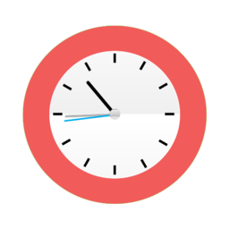

```
<svg xmlns="http://www.w3.org/2000/svg" width="500" height="500" viewBox="0 0 500 500"><ellipse fill="#F15B5A" stroke="#8DC63F" stroke-width=".1" cx="249.991" cy="250.016" rx="200.327" ry="194.376" style="position:relative"/>
    <radialGradient id="a" cx="250.011" cy="249.978" r="140.386" gradientUnits="userSpaceOnUse"><stop offset=".687" stop-color="#FFF"/>
         <stop offset="1" stop-color="#EFEFF0"/>
    </radialGradient><ellipse fill="url(#a)" stroke="#FFF" cx="250.011" cy="249.978" rx="142.108" ry="138.642" style="position:relative"/>
    <path d="M247.7 116.535h4.623v19.64H247.7zM247.7 360.892h4.623v19.64H247.7zM184.318 137.683l4-2.31 9.822 17.01-4.002 2.31z"/>
    <path style="position:relative" d="M306.504 349.315l4.004-2.31 9.818 17.01-4.003 2.31zM136.844 186.842l2.31-4.002 17.01 9.817-2.308 4.002zM346.08 308.306l2.313-4.003 17.01 9.823-2.313 4.002zM115.703 246.223h19.64v4.62h-19.64zM360.06 246.224h19.64v4.62h-19.64zM136.844 316.535l-2.31-4.003 17.008-9.82 2.31 4.003zM348.478 194.366l-2.31-4.003 17.01-9.82 2.31 4.002zM186.007 363.996l-4.003-2.31 9.82-17.012 4.002 2.31zM308.203 152.387l-4.003-2.31 9.82-17.01 4.004 2.31z"/>
    <path d="M188.938 181.505c-.97-1.158-.67-3.01.675-4.14 1.345-1.127 3.223-1.102 4.193.055l58.528 69.75c.97 1.157.67 3.01-.675 4.14-1.346 1.127-3.224 1.103-4.195-.056l-58.527-69.75z"/>
    <path fill="#B3B3B3" d="M144.693 255.69c-1.754.062-3.208-.843-3.25-2.025-.04-1.178 1.347-2.185 3.1-2.245l105.65-3.692c1.753-.06 3.21.848 3.25 2.028.04 1.18-1.348 2.188-3.102 2.248l-105.647 3.687z"/>
    <path fill="#00AEEF" d="M142.773 264.695c-1.742.212-3.227-.208-3.318-.943-.09-.735 1.25-1.505 2.99-1.72l104.927-12.884c1.742-.213 3.227.21 3.317.946.09.735-1.25 1.505-2.992 1.72l-104.925 12.88z" style="position:relative"/>
    <linearGradient id="b" gradientUnits="userSpaceOnUse" x1="242.335" y1="256.5" x2="258.266" y2="240.569">
        <stop offset=".017" stop-color="#EAEAEA"/><stop offset="1" stop-color="#BFBFBF"/>
    </linearGradient><circle fill="url(#b)" stroke="#B3B3B3" stroke-width=".1" cx="250.301" cy="248.534" r="11.265"/>
</svg>
```

занимает 1.98 KБ

Параметры объектов хранятся и могут быть легко изменены. Также это означает что перемещение, масштабирование, вращение, заполнение и т. д. не ухудшает качества рисунка. Более того, обычно указывают размеры в аппаратно-независимых единицах (англ. device-independent unit), которые ведут к наилучшей возможной растеризации на растровых устройствах.

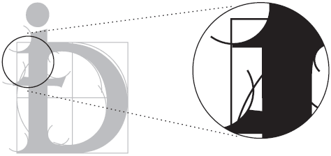

Таким образом, основные достоинства векторных изображений:
- легко масштабировать изображение в сторону уменьшения или увеличения
- размер конечной картинки зависит только от количества и свойств фигур, изображенных на ней, а не от физического размера изображения
- парамтры объектов, использованных в изображении, могут быть легко изменены

Но не всё так просто. Одно из основных достоинств, описательное хранение информации, одновременно может стать и отрицательным качеством. Это очень хорошо проявляется на более сложных изображениях, когда приходится применять ощутимо большое количество сложных объектов. Например:


```
<svg version="1" xmlns="http://www.w3.org/2000/svg" width="400" height="400" viewBox="0 0 300.000000 300.000000">
    <g fill="#567660">
        <path class="node" d="M147.5 61l-5 3.7-3-2.3c-1.7-1.2-4.2-2.7-5.7-3.3-2.6-1-2.7-.9-2.3 1.7.2 1.5.6 4.6.9 6.8l.6 4.2-5.5.4c-6 .5-7.8 1.4-5.5 2.8.8.4 3.2 2.3 5.2 4.1l3.6 3.2-3.1 1.6c-1.7.9-4.2 3.1-5.4 5-1.9 2.8-2.3 3-2.3 1.3 0-2.7-1.5-3.6-3-1.7-.6.8-3.3 1.7-5.8 2.1-4.9.7-8.2 2.7-8.2 5.1 0 .7-.5 1.3-1.1 1.3-.8 0-.9-1.5-.4-4.8.6-4.5.6-4.6-1.1-3-1.3 1.2-1.9 3.9-2.2 9.7-.2 4.5-.6 8.1-.8 8.1-.3 0-1.3-.5-2.3-1.2-1.5-.9-2.6-.7-5.5 1-2.1 1.2-4.6 2.2-5.7 2.2-2.7 0-2.4 1.3 1.2 3.9 6 4.5 13.9 3.8 13.9-1.2 0-1.8.5-1.6 3.9 1.8l4 3.8-3.6 1.9c-7.6 4.1-12.3 10.9-12.2 17.8 0 9.4 6.2 16 15 16 6.3 0 11.1-2.5 14.4-7.5 2.2-3.3 2.5-4.7 2.1-8.4l-.6-4.4 4.1.6c5 .7 9.9 4.9 9.9 8.7 0 4.3-2.6 6.6-10.5 9.5-13.4 4.9-15.8 11-8.4 21.6l4.2 5.9-2.8 6.2c-1.5 3.5-3.6 8.3-4.7 10.8s-2.5 5.8-3.2 7.5c-11.8 27.1-15.5 33.3-19.3 32.1-2.7-.9-8-6.2-8.6-8.7-.6-2.2.8-2.6 1.7-.4.9 2.4 7.1 1.9 9.6-.8 2.5-2.6 4.7-7.3 5.6-12.4l.7-3.7-2.8 2.2c-1.8 1.4-4.2 2.2-6.6 2.2-4.9 0-7.9 2.8-8 7.2 0 3.1-.1 3.2-1 .9-.5-1.3-.7-3.2-.4-4.2.4-1.1.3-2.8 0-4-1.3-3.9-3.5 2.6-3.5 10.2v6.9l-2.5-1.2c-1.8-.8-3.2-.8-5.5.2-1.6.7-3 1.6-3 2.1s-1.2.9-2.7.9h-2.6l2.2 2.4c2.5 2.7 9.3 5 12.2 4.1 1.1-.4 2.4-1.8 3-3.2l.9-2.4 2.5 2.9c3 3.6 3.1 4.2.4 4.2-1.5 0-2 .5-1.7 2.2l.3 2.3h23c22.2 0 23-.1 23-2 0-1.5-.9-2.1-4.3-2.7-5.9-1-9.4-2.9-11.1-5.9-1.4-2.4-1.2-3.4 1.4-11.3 1.6-4.8 3.3-8.9 3.7-9.2.4-.3.8 1.8.8 4.6 0 13.1 11.5 23.8 26.5 24.8 9.1.5 16.4-2.1 22.4-8 6.3-6.3 7.5-9.1 7.5-17.8 0-7.8-1.1-11.2-6-17.7-1.3-1.7-2.4-3.4-2.4-3.6 0-.8 14.2.1 15 1 1.6 1.7 11.9 28 12.6 31.9.3 2.4.2 5-.5 6.1-1.3 2.6-7 5.3-11.1 5.3-2.7 0-3.1.3-2.8 2.2l.3 2.3h58l.1-2.6c0-1.4 1.3-4.2 2.9-6.3 4.1-5.3 4.7-13.6 1.3-18.5-1.2-1.9-3.7-4.1-5.5-5-2.9-1.5-3.1-2-3.1-6.7.1-5.4-.9-7.4-7.2-15.4-5-6.4-6.2-8.8-7.6-15.4-1.1-5.2-1-6.4.6-10.1 1.9-4.3 3.4-5.5 7.5-5.5 4.2 0 7.2 6.9 4.8 11.3-1.8 3.6-4.9 3.5-6.8-.3-1.9-3.7-3.5-3.1-3.5 1.3 0 4.9 2.4 7.7 6.6 7.7 4.7 0 6.9-1.3 8.8-5.1 3.5-6.9.2-17.9-6.1-20.8-7.5-3.4-16.3 1.8-18.6 11.1-.8 3.2-1.5 3.4-4.2 1.4-1.9-1.4-1.9-1.5.9-4.3 1.6-1.5 3.5-4.2 4.2-6 1.9-4.4 1.7-12-.4-16.3-2-4.1-7.5-8-11.2-8-10 0-16.4 12.8-10.8 21.7 2.6 4.3 7.9 6.8 10.9 5.2 3.3-1.7 3.3-.3.1 2-5.5 3.9-10.6 2.1-14.2-4.9-3-5.9-2.5-9.9 2.6-21 2.5-5.5 4.6-11.3 4.6-12.8.1-4.6-2.9-9.7-7.2-12.1l-4-2.2 3-3.1c1.7-1.7 3.2-2.9 3.3-2.7.1.2.7 1.3 1.2 2.3 2.3 4.1 8.4 3.7 14-.8 2.8-2.3 2.9-2.5 1-3.1-1.1-.3-3.3-1.3-4.8-2.1-3.3-1.6-7.3-1.8-8.2-.4-1.5 2.4-2 .5-2-6.8-.1-5.9-.5-8.4-1.9-10.2l-1.8-2.5.7 4.7c.7 5.2-.8 6.7-2.4 2.4-1.1-2.7-2.1-3.2-8.5-4.1-2.5-.4-4.9-1.1-5.2-1.6-.9-1.6-2.4-1-2.4 1 0 2.8 3.6 10.7 5.9 13 2.4 2.4 7.9 2.8 10 .8.9-.7.7 0-.3 2-2 4-4.5 5.7-12.1 8.3-3.2 1.1-5.9 2-6 2-.1 0-1-1.9-1.9-4.3-2.9-6.8-3.2-7.2-5.7-7.2-1.9 0-2.6.7-3.3 3.8-.8 3.1-.6 4.7 1.3 9 1.3 2.9 3.1 7.2 4 9.7 1 2.5 2.5 6.1 3.4 8 .8 1.9 4.6 10.9 8.3 20 6.5 16.1 24 58.5 29 70.5 1.4 3.3 2.9 6.8 3.5 7.7 1.3 2.6 1.1 3-1.3 2.6-2.5-.4-3-1.5-20.3-43.8-10.1-24.6-12.4-30.2-13.6-32.2-.5-1-.9-2.2-.9-2.7s-1.3-3.8-2.8-7.3c-1.6-3.5-5-11.5-7.6-17.8-2.6-6.3-5-12.1-5.4-12.7-.5-.7-5.1-1.6-10.9-2.2-11.3-1-15.5-2.8-17.4-7.2-2.6-6.3 3.3-14.7 9.5-13.5 5.5 1.1 9.5 8.3 6.4 11.4-1.7 1.7-5.7 1.5-6.4-.3-.8-2.1-2.4-1.9-2.4.3 0 2.6 2 4.2 5.3 4.2 4.4 0 6.5-1.7 7.7-5.9 1.4-5.4 4.2-8.5 9-10.1 3.7-1.2 4.5-1.2 8.5.8 2.5 1.2 4.5 1.9 4.5 1.6 0-3.1-7.6-8.4-12-8.4-1.2 0-3.5.7-5.2 1.6l-3.1 1.6.7-2.9c1-3.6 1.4-3.9 2.8-2.5 2.2 2.2 6.3 1.3 10.1-2.2 3.3-3 5.3-6.7 2.8-5.1-.5.3-3 0-5.5-.7l-4.5-1.2-.3-6.2-.3-6.1-5 3.7zM144 71c0 .5-.4 1-1 1-.5 0-1-.5-1-1 0-.6.5-1 1-1 .6 0 1 .4 1 1zm-5 6.6c0 4.7-.3 5.5-1.6 5-.9-.3-2.1-.6-2.7-.6-.7 0-.4-.7.7-1.5 1.4-1.1 1.7-2.2 1.3-5-.4-2.6-.2-3.5.9-3.5 1 0 1.4 1.4 1.4 5.6zm10-4.1c0 .8-.4 1.5-.9 1.5s-1.4-.7-2.1-1.5c-1-1.3-.9-1.5.9-1.5 1.2 0 2.1.6 2.1 1.5zm-4 12c0 .8-.4 1.5-1 1.5-.5 0-1-.7-1-1.5s.5-1.5 1-1.5c.6 0 1 .7 1 1.5zm-25.1 10.7c-.4 4.6.2 6.7 2.6 9.7 3.7 4.3 7.2 5.9 16.5 7.5 9.4 1.6 9.6 2.2 4.5 13.1-3.4 7.3-4.7 8.7-6.1 6.4-.3-.6-2.6-2-4.9-3-3.6-1.6-5.9-1.8-13.6-1.4-9.9.5-11.3 1.2-12.5 5.9-.5 2.2-.4 2.7.6 2.1.9-.6 1-.3 0 1.5-1.7 3.2-.9 3.2 3.9-.1 5-3.3 5.9-3.5 6.7-1.4 1.1 2.8-.6 6.5-3.9 8.5-4.5 2.8-8.1 2.5-11.9-.9-2.9-2.6-3.3-3.5-3.3-8.3 0-10.6 7.5-16 22.2-16 7.7 0 8.5-.2 6.8-1.4-1.8-1.4-3.5-1.7-12.6-2.9-4.9-.6-7.9-3.1-11.5-9.2-2-3.6-1.4-5.4 1.1-2.9 3.6 3.6 10.3.5 12.6-5.9 1.5-3.9 3.1-4.7 2.8-1.3zm62.2 16c4.3 2.3 7.1 6.8 6.2 9.7-1 3.1-6.7 16.6-7.3 17.4-.6.7-13-26.8-13-28.7 0-1.6 10.2-.4 14.1 1.6zm-22 34.2c3.3 7.6 5.6 14.2 5.3 14.7-.3.5-1.6.6-2.9.3-3.2-.8-6.4 1.2-8 4.8-1.1 2.8-1 3.3.8 5.4 3 3.5 5.9 3 10.1-1.6 2-2.2 3.6-3.5 3.6-2.9 0 .5 1.1 3.4 2.4 6.2 1.4 2.9 2.8 6.4 3.1 8 .4 1.5 1.1 3 1.6 3.3.5.3.9 1.2.9 2 0 1.1-1.5 1.4-6.7 1.4-6.2-.1-6.6-.2-4.9-1.5 1.1-.8 1.8-1.6 1.5-1.7-5.2-3.2-10.1-5-11.1-4-2.1 2.1-2.5 1.3-3-6.4-.6-8.9-2.8-12.6-2.9-4.9 0 4.4-.2 4.7-1 2.4-1.1-2.8-4.6-4.9-8.4-4.9-1.4 0-2.5-.4-2.5-1 0-.8 4.5-11.7 9.1-21.8 1.1-2.4 2.7-6.1 3.6-8.3.8-2.2 2-3.8 2.6-3.6.5.1 3.6 6.5 6.8 14.1zM111.5 134c-.3.5-1.1 1-1.6 1-.6 0-.7-.5-.4-1 .3-.6 1.1-1 1.6-1 .6 0 .7.4.4 1zm92.8 7c3 2.4 4.5 8.1 2.9 11.3l-1.1 2.2v-2.3c-.1-2.6-2.8-7.2-4.3-7.2-.6 0-.7.7-.4 1.5.3.8.9 2.1 1.2 2.9.3.7-.2 2.1-1.1 3-1.3 1.2-2.1 1.4-3.6.5-4.4-2.3-4.8-10.7-.6-12.7 3.2-1.5 4.1-1.4 7 .8zM129 159.4c0 1.9-3.9 10.6-4.8 10.6-1.3 0-4.3-6-3.6-7.1.7-1.2 6.5-4.9 7.7-4.9.4 0 .7.6.7 1.4zm74.5 12.5c5.2 2.3 6.4 3.5 9.6 9.5 3.5 6.5.8 14.6-4.7 14.6-3.1 0-5.8-4.2-5-7.6.5-1.9 1.2-2.5 2.9-2.2 1.7.2 2.3 1.1 2.7 3.7.5 3.1.6 3.3 1.9 1.7 1.9-2.2.4-8.4-2.5-10.2-1.7-1.2-2.5-1.1-5.9.6-2.1 1.1-3.9 1.9-4 1.7-1.2-1.9-5.5-13.2-5.5-14.2 0-1.6 3-.9 10.5 2.4zm-63.2 7c1.1.9 3 1.2 5.3.8 3.5-.6 3.5-.6 2.1 1.6-2.2 3.3-9.4 6.7-14.4 6.7-2.3 0-4.3-.4-4.3-.9s.9-3.1 2.1-5.8c1.1-2.6 2.5-5.9 3-7.2l1-2.5 1.8 3c1 1.6 2.5 3.5 3.4 4.3zM152 187c0 .5-.4 1-1 1-.5 0-1-.5-1-1 0-.6.5-1 1-1 .6 0 1 .4 1 1zm72.8 10.3c4 4.1 5.1 8.7 2.6 11.1-1.8 1.9-6.2 1.5-7.6-.7-1-1.5-1-1.9.1-3.6.8-1.2 1.4-1.3 3.5-.3 2.3 1 2.6.9 2.6-.6 0-1-.5-2.3-1.2-3-1.5-1.5-6.4-1.6-7.3-.2-.3.5-1.1 1-1.6 1s.3-1.6 1.8-3.5 3-3.5 3.4-3.5c.3 0 1.9 1.5 3.7 3.3zm-89.4-.4c.3.4-1.1 1.3-3.2 1.9-2 .7-5.1 2.5-6.9 4.2-3.6 3.4-4.3 3.6-4.3 1.5 0-.8 1.6-3 3.5-5 2.7-2.6 4.4-3.5 7-3.5 1.8 0 3.6.4 3.9.9zm21.7 1.4c5.1 3.4 9.6 10 10.9 16 1.1 4.8 1 5.8-1 10.4-3.8 9-10.5 13.3-20.6 13.3-7.6 0-12.5-2.1-17.2-7.4-10.4-11.9-3-27.6 12.9-27.6 11.9 0 20.3 13.7 13.3 21.9-4.8 5.8-15.4 5.1-19.3-1.3-2.6-4.2-2.6-5.7 0-9 2.5-3.2 7-3.5 9.9-.6 3.2 3.2 1.9 7.8-1.5 5-2.2-1.9-6.1-.9-5.7 1.5.6 3.3 2.8 4.8 7.2 4.8 4.6 0 7.5-2.1 8.5-6.3 1-4.1-3.9-10.6-8.9-11.9-12.5-3.4-22.3 8.7-15.3 19 8.2 12.1 26.4 11.3 32.6-1.4 1.8-3.8 2-5.1 1.1-9.6-.5-2.8-1.4-5.9-1.9-6.9-1.6-3-6.4-6.9-10.8-8.8-2.4-1-4.3-2.1-4.3-2.6 0-1.7 6.9-.7 10.1 1.5zm55.9 4.6c0 1.3-2.7 2.1-4.5 1.5-.8-.4-1.2-1-.9-1.5.7-1.2 5.4-1.2 5.4 0zm4.1 9.2c2.8 3 2.9 3.3 1.4 5.5-.8 1.3-1.5 3-1.5 3.9 0 4.4-4.8-2.9-6.6-10.2-.9-3.5 3.1-3 6.7.8zm16.4 6.5c3.7 1.5 5.6 9.3 3.4 13.7-3.3 6.3-7.4 8.1-11.7 5.1-3-2.1-2.8-3 .8-3.8 1.9-.3 3.4-1.5 4.2-3.1 1.3-2.9.1-4.9-1.3-2.2-1.6 2.7-6.3 2.2-7.7-.8-1.4-3.1.6-8 3.5-8.8 2.8-.7 7-.8 8.8-.1zM208 74c-.8.5-4 1-7.1 1-4 0-6.1.5-7 1.7-1.9 2.2-1.8 10.1.1 11.3 2.6 1.6 6.6 1.1 9.2-1.3 4.8-4.2 9-15.4 4.8-12.7zM78 83.1c0 .8 1.4 3.8 3 6.7 5.3 9.1 13.8 10.8 15.5 3.1 1.2-5.3-1.9-8.3-9.1-9-3.2-.3-6.7-.9-7.6-1.3-1.2-.6-1.8-.4-1.8.5z"/><path class="node" d="M86 152.5c0 1.3-.7 4.3-1.6 6.5-.9 2.2-1.4 4.7-1 5.5.3.8.4 1.5.3 1.5-.1 0-2-.7-4.2-1.5-4-1.4-11.5-2-11.5-.9 0 .3.9 1.7 2 3.1 1.1 1.4 2 3.4 2 4.4 0 2.8 3.6 5.9 6.8 5.9 3.9 0 6.6-3.1 6-7-.5-3.5-.4-3.6 2.7-1.2l2.2 1.8-2.3 2.8c-2.6 2.9-3.1 7.4-1.3 10.8.9 1.7 1.3 1.8 2 .7.6-1 .9-1.1.9-.2 0 .7.9 1.3 2.1 1.3 1.5 0 1.9.4 1.5 1.6-.3.9-.6 1.7-.6 2 0 .2-1.2-.1-2.6-.6-3.7-1.4-4.7-1.3-7.3 1.2-2.1 1.9-2.3 2.7-1.7 7.6.4 2.9 1.3 6.6 2 8l1.4 2.6 1.5-3c.8-1.6 2.9-4.2 4.6-5.8 1.7-1.7 3.1-3.7 3.1-4.5 0-1 .3-1.2.8-.6 1.1 1.6 5.5 3.3 10.6 4 3.9.6 4.6.5 4.6-.9 0-.9-.4-1.6-.9-1.6-.8 0-4.1-8.1-4.1-9.9 0-.3 1.5-.7 3.3-.8 3.3-.2 10.7-3.3 10.7-4.5 0-.3-1.2-1.1-2.7-1.7-1.6-.5-4.3-2.4-6.2-4-3.2-2.8-3.3-3.2-1.9-4.8 1.7-1.9 5.2-11.2 4.5-11.9-.2-.2-2 .3-4 1.1s-4.7 1.5-6.1 1.5c-1.4 0-2.8.4-3.1 1-1.1 1.7-2.2 1.1-3.4-1.8-1.2-2.8-7.3-10.2-8.4-10.2-.4 0-.7 1.1-.7 2.5zm12.4 20.3c2.1 1.6 2.2 2 .9 3.8-.9 1.2-1.2 3.1-.8 5.1.5 3.1.4 3.3-2.1 3.3-2 0-2.4-.3-1.7-1.3 2.9-3.6 2-12.7-1.2-12.7-2 0-1.9-1 .3-2.6 1.4-1.1 1.7-1 2 .6.2 1.1 1.4 2.8 2.6 3.8zM59 208.5c3 8 7.2 12.5 11.4 12.5 4.3 0 5.6-1.1 6.3-5.3.8-5-3-8.9-8.4-8.6-2.1.1-5.3-.1-7.1-.5-3.2-.7-3.2-.7-2.2 1.9z"/>
    </g>
</svg>
```

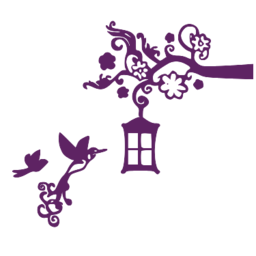
```
<svg version="1" xmlns="http://www.w3.org/2000/svg" width="400" height="400" viewBox="0 0 300.000000 300.000000">
    <g fill="#5E2363">
        <path class="node" d="M129.6 25.5c-.9.9-1.6 2.8-1.6 4.2 0 2.5 0 2.6-2 .8-1.7-1.6-2-1.6-2-.2 0 3 4.9 5.7 10.4 5.7 2.8 0 5.8.5 6.6 1.1 1.7 1.1-9.6.7-14-.5-2.3-.7-2.2-.5 1 2.3 2.9 2.6 4.2 3.1 8.6 3.1 7.6 0 11.1 1.6 13.4 6.1 1.1 2.1 2 4.6 1.9 5.6-.1 1-.6.4-1.1-1.4-.6-1.7-2.3-4.4-3.9-5.9-2.4-2.3-3.8-2.8-7.9-2.8-6.3 0-9 2.2-9 7.4 0 4.9 3.5 8.3 8.1 7.8 2.4-.2 3.7-1 4.6-2.8 1.6-3.2-.1-5.2-2.1-2.5-1.3 1.8-1.5 1.8-4 .2-3.2-2.2-3.3-5.2-.2-7.2 7.3-4.8 15.2 7.4 11.1 17.1-1.9 4.6-2.2 13.1-.6 16.2 1.1 2 .9 2.2-1.9 2.2-2.4 0-4.3 1.3-8.9 6-6 6.1-7.8 6.9-9.9 4.8-2-2-1.4-2.9 1.4-2.2 2 .5 2.5.3 2.2-.7-.7-2-5.8-2.5-5.8-.5 0 .9-.9 1.6-2 1.6s-2 .6-2 1.2c0 .9-.3.9-.9-.1-.6-.9-.6-2.2.1-3.4 1.3-2.4.3-3.4-1.8-1.6-1.1.9-1.4 2.2-1 4.1.4 1.8.1 2.8-.7 2.8-.6 0-1.9.5-2.7 1-1.3.9-1.1 1.3 1 2.9 1.4 1.1 2.2 2.2 1.9 2.6-.4.3-2-.6-3.7-2-1.6-1.4-3.6-2.5-4.4-2.5-.8 0-1.9-.5-2.6-1.2-.9-.9-1.2-.8-1.2.6 0 .9-.5 1.4-1.1 1.1-.5-.4-2.1-.4-3.5-.1-3 .8-3.3 5-.5 6.6 2.8 1.5 3.3 1.3 2.1-1-1.7-3.3 1.1-3.5 7.3-.6 8.9 4.2 13.7 3.4 21.3-3.6l4.6-4.2 2 2.7c3.1 4.3 7.8 3.1 7.8-2 0-1.6-.6-2.3-2-2.3-1.1 0-2 .5-2 1.1 0 .5-.4.7-1 .4-1.5-.9-1.2-3.1.6-4.9 3.4-3.5 18.1-.3 22.3 4.8 1.3 1.5 1.6 1.5 3.8.1 1.4-.9 3.8-1.5 5.6-1.3 2.7.3 2.9.5 1.2 1.2-10.9 4.2-14.5 7.3-16.8 14.1-2 5.8-.6 11.5 3.9 15.9 2.9 2.8 3.2 3.6 2.9 7.8-.4 3.8-.1 4.8 1.3 5.1 1.2.3 1 .5-.6.6-2.4.1-9 3.2-13.3 6.2-1.5 1.1-3.5 1.6-4.7 1.2-2.4-.6-4.3 2.4-2.3 3.6 4.6 2.9 4.3 45.9-.4 51.1-.9 1-1.4 2.4-1 2.9 1 1.7 4.3 1.3 5.4-.7.8-1.5 2.8-1.7 16.8-1.7 15.3 0 15.9.1 18.2 2.4 2.2 2.2 2.4 2.2 4 .6 1.5-1.5 1.4-1.8-.6-3.4-2.7-2.2-4.5-11.3-4.6-22.6 0-10.4 2.8-26.6 5-28.2 2.8-2.1.8-4.2-3.9-4-3.9.1-8.6-2.2-14.7-7-.3-.2-.4-2.7-.2-5.6.1-3.6.7-5.5 1.8-6.2 5.8-3.6 6.7-6.9 2.7-10.9-4.7-4.6-11.4-2.7-10 2.9.8 3 4.9 3.5 6.6.7.9-1.5 1-1.4.8.8-.2 2-.9 2.6-3.4 2.8-3.5.3-6.1-2-6.4-5.8-.5-5.7.1-8.1 2.8-11.1l2.8-3.2 1.3 3c.7 1.7 2.3 3.6 3.6 4.3 2 1.1 2.8 1 5-.4 3.3-2.1 4.1-4.2 2.5-6.1-1.6-2-4.9-1.9-5.7 0-.7 2 .5 3.4 1.5 1.8.5-.8 1.2-.9 2.2-.2 1.3.8 1.3 1 0 1.9-4 2.6-7.8-.1-5.9-4.3 1.4-3 5.1-4.2 8-2.6 1.2.6 3.7.9 5.5.7 2.9-.3 3.3-.1 2.8 1.4-.8 2.8 2.2 6.8 5.1 6.8 1.7 0 2.5.6 2.5 1.8 0 4.9 6.1 8.1 9.2 4.8 1.1-1.1 1.8-1.1 4.6.2 4.2 2 6.6.8 7-3.7.2-2.2.8-3.1 2.1-3.1 4.5 0 5.5-5.7 1.6-8.8-2.3-1.8-2.4-2.2-1.2-4.5 1-2 1.7-2.3 3.1-1.5 2.2 1.2 4.6-.6 4.6-3.6-.1-2-.1-2-1.5-.2-1.5 2-3.5 1.4-3.5-1.3 0-4.9 5.2-5.3 14.1-1.1 6.1 2.8 7.4 3 26.8 4 11.2.5 23.9 1 28.2 1h7.9V74.8l-8.7.6c-27.3 1.9-47.1 2.5-50.8 1.6-4.9-1.1-9.5-5.9-9.5-9.8 0-6.9 3-9.7 7.2-6.8 1.9 1.3 1.9 1.6.5 2.2-2 .7-2.3 4.4-.5 6.2 1.8 1.8 5.6 1.4 7.8-.8 1.4-1.4 2-3.3 2-6.4 0-2.5.5-4.8 1-5.1 1.4-.9 1.3-4.5-.2-4.5-.6 0-.4-.8.6-1.9 2-2.2 1.2-4.9-1.9-5.7-1.3-.3-2.5-1.4-2.8-2.5-.7-2.5-3.5-3.5-5.7-2.1-1.5.9-1.8.6-2.4-2.8-1.1-7.3-9.6-11.3-16.5-7.7-5.5 2.8-8.8 11.2-7.1 17.8 1.2 4.3 7.1 10.4 11.7 12.1 3 1.1 3.3 1.5 3.3 5.5 0 2.4-.4 4.3-.9 4.3s-2.8-.9-5.2-2c-2.6-1.2-6.6-2-9.9-2-6.5 0-9.9-1.5-11.9-5.2-1.3-2.2-1.3-2.9-.2-4.2 1.7-2 5-2.1 5.8-.1.8 2.1-.6 3.3-1.7 1.5-1.1-1.8-2.4-.6-1.6 1.5 1 2.8 5 1.5 5.4-1.7.6-5.4-8.8-6.5-10.8-1.2-.7 1.7-.5 3.7.5 6.6.8 2.3 1.3 4.3 1.2 4.3-.1.1-1.6 1.1-3.4 2.3-4 2.8-4.2 2.8-8.3-.7-3-2.5-3.3-3.1-2.1-4.5 1.8-2.1 3.3-2 2.9.1-.2 1.1.3 1.8 1.2 1.8 1.8 0 2.6-4.3 1.1-5.8-.5-.5-2.2-1-3.7-1.1-3.6-.1-4.5-2.6-1-2.6 1.4 0 2.6-.5 2.6-1 0-1.5-4.7-1.2-6.4.5-2 2.1-2.6 1.9-2.6-.9 0-1.3-.7-2.9-1.5-3.6-1.3-1-1.5-.9-1.5 1.1 0 1.3-.4 3-.9 3.8-.7 1.1-1 .9-1.6-.8-.3-1.1-.4-2.5 0-3.1.3-.5.8-2.6 1.1-4.6.3-2.9.1-3.5-1.1-3-1.1.4-1.5-.1-1.5-1.8 0-3.2-2.4-5-5.5-4.2-2 .5-2.5 1.3-2.5 3.6 0 3 2.4 4.3 3.2 1.8.2-.6 1-.8 1.6-.4.8.4 1.2 3.4 1.2 8 0 6.8.2 7.5 3.5 11.3 1.9 2.3 6 5.8 9.1 7.8l5.7 3.8-3.8 3.2-3.8 3.1-2.3-2.2c-1.3-1.1-2.4-3.1-2.4-4.3 0-1.7-.6-2.1-3-2.1-2.9 0-3-.1-2.8-4.4.3-5-1.9-8.3-5.6-8.8-1.9-.3-2.1-.9-2.1-6.3-.1-9.2-.3-10-3.1-12.9-2.9-2.8-6.7-4.1-17.8-5.9-6.7-1.1-7.1-1.4-7.4-4-.3-2.1.1-2.7 1.5-2.7s1.5.2.4.9c-1 .6-1 1-.1 1.6 1.9 1.1 3.7-1.2 2.4-3.2-1.5-2.4-2.9-2.6-4.8-.8zm98.4 7.4c1.2 2.4 1.3 6.8.1 7.5-.5.3-1.2-.1-1.5-1-.4-.9-1.5-1.4-2.8-1.2-2.1.3-2.3.9-2.3 5.7 0 3.7.6 6.2 1.8 7.7 1.7 2.2 2.3 4.4 1.1 4.4-2.3 0-8.3-4.7-10.2-8-3.1-5.4-2.9-9.2.9-13.5 2.7-3 3.7-3.5 7.5-3.5 3.3 0 4.6.5 5.4 1.9zm-77.9 8.2l2.4 2-3-1.7c-3.9-2.4-4-2.4-2.8-2.4.6 0 2.1.9 3.4 2.1zm73.6 2.1c-.3.8-.6.5-.6-.6-.1-1.1.2-1.7.5-1.3.3.3.4 1.2.1 1.9zm8.4 4.2c-2.5 4.6.8 8.8 4.8 6 2.6-1.9 2.6-2.8 0-5.3-2.2-2-2.3-5.1-.1-5.9.7-.2 1.2.6 1.2 2.2 0 2.2.4 2.6 3 2.6 3.4 0 4.1 1.9 1 2.7-2.6.7-2.5 1.7.3 3.7 2.2 1.6 2.2 1.6-1.3 1.4-3-.3-3.5 0-3.8 1.9-.4 2.8-1.8 2.9-3.2.3-1-1.8-1.3-1.9-2.6-.5-.9.8-1.9 1.5-2.4 1.5-1.5 0-2.3-2.1-1.1-3.3 1.8-1.8 1.3-3.7-1.5-4.7-2.8-1.1-2.3-3.4.6-2.5 2.3.7 3.6-1.1 2-2.9-1.5-2 1-2.8 2.9-1 1.2 1.1 1.3 1.7.2 3.8zm3.9 3.7c0 .5-.4.9-1 .9-.5 0-1-.7-1-1.6 0-.8.5-1.2 1-.9.6.3 1 1 1 1.6zm6 10.9c0 1.8-.8 3.4-2.2 4.4-2.7 1.9-4.8 2.1-4.8.4 0-.6.3-.8.7-.5.3.4 1.2.2 2-.4 1-.9 1-1.5.2-2.5-.8-.9-.6-1.8.8-3.2 2.3-2.4 3.3-1.9 3.3 1.8zm-82.8 3.7c1 .9 1.8 2 1.8 2.5s-.7.2-1.6-.7c-.9-.9-2.4-1.5-3.3-1.3-2.5.5-2.6 4.6-.2 6.7 2.1 1.8 2.1 1.9.1 2.4-2.6.7-3.6 3.5-2.1 5.9 1.2 2 .6 4.2-1 3.2-2-1.2-4.9-8.5-4.9-12.1 0-5.2 2.3-8.3 6.2-8.3 1.7 0 4 .7 5 1.7zm4.8 8.4c0 1 .7 1.9 1.5 1.9s1.5-.5 1.5-1c0-.6.7-1 1.5-1s1.5.6 1.5 1.4c0 2.1-2.4 3.6-4.8 2.9-1.4-.3-3 .1-4.2 1.2-2.3 2.1-5.4 1.6-5.8-.9-.4-1.6 0-1.8 2.8-1.2 3 .5 3.2.4 2.7-1.6-.7-2.4 1-5.1 2.4-4.2.5.3.9 1.4.9 2.5zm51.8.3c6.7 3.4 7.8 4.9 4.7 6.6-1.3.7-2.8 2.5-3.3 4-.9 2.4-1.4 2.6-5.3 2.4-2.9-.1-4.5-.7-4.7-1.6-.2-.9-1.5-2.1-2.9-2.9-2.4-1.3-2.7-1.2-5.3 1.9-1.7 2.1-3 2.9-3.4 2.3-1.1-1.8-5.6-1.3-8.7 1-3.1 2.1-3.9 4.2-1.4 3.3 1.8-.7 1.9.6.2 3-.8 1.1-2.3 1.7-3.8 1.4-2-.2-2.5-.9-2.7-4.1-.4-4.6.9-6.3 8.8-11.7 13.1-8.9 19-10.1 27.8-5.6zM172.5 82c0 .8-1 1.6-2.2 1.8-1.8.3-2.3-.2-2.3-1.8s.5-2.1 2.3-1.8c1.2.2 2.2 1 2.2 1.8zm-7.5.5c0 .8-.4 1.5-1 1.5-.5 0-1-.7-1-1.5s.5-1.5 1-1.5c.6 0 1 .7 1 1.5zm-.8 5c1 1.3 1 4.5 0 4.5-.4 0-1.3-1.5-2.1-3.3-.7-1.7-1.5-2.6-1.8-2-.6 1.6-2.9 1.7-3.9.1-.4-.6.1-1.7 1.1-2.4 1.6-1.2 2.2-1.1 3.9.4 1.2.9 2.4 2.1 2.8 2.7zm6.4 1.4c-.9 1.4-1.7 1.4-4-.4-1.6-1.2-1.7-1.7-.6-3 1.2-1.5 1.5-1.4 3.3.3 1.1 1.1 1.6 2.5 1.3 3.1zm34.8.1c0 1.4-.4 3.5-.8 4.8-.7 2.2-.7 2.2 1.8-.3 3.2-3.2 6.1-3 6.1.5 0 1.6-.8 2.8-2.2 3.5-2.9 1.3-2.9 2.5 0 2.5 2.6 0 6.7 2.6 6.7 4.2 0 .7-1.9.9-5.7.5l-5.8-.6 2.5 1.9c1.4 1.1 2.9 2 3.3 2 1.7 0 .1 4.5-1.6 4.8-2.4.5-5.7-2.5-5.8-5.2-.1-1.4-.4-1-1 1.2-1.2 4-3.4 5.1-5.7 2.8-1.6-1.6-1.6-1.9 0-4.6 1.8-3.2 1.4-3.6-2.7-2-5.6 2.1-9-3.4-3.7-6 1.5-.8 2.9-1.5 3-1.6.2-.1-.6-1.2-1.7-2.3-2.5-2.5-2.7-4.4-.6-6.1 1.2-1 2.1-.7 4.7 1.5l3.3 2.8.3-2.4c.5-4.2 1.1-5 3.4-4.7 1.7.2 2.3.9 2.2 2.8zM161 164.5v8.5h-11v-17h11v8.5zm15.8.2l.3 8.3h-5.5c-4 0-5.5-.4-6-1.6-.8-2.2-.8-13.9.1-14.8.4-.4 3-.6 5.8-.4l5 .3.3 8.2zM161 184v8h-11v-16h11v8zm16 .5v8.5h-5.4c-4 0-5.5-.4-6-1.6-.8-2.1-.8-13.9.1-14.7.3-.4 3-.7 6-.7h5.3v8.5z"/>
        <path class="node" d="M195 98c0 .5.5 1 1 1 .6 0 1-.5 1-1 0-.6-.4-1-1-1-.5 0-1 .4-1 1zM194.8 40.5c-2.2 2.9-2.3 5.4-.3 6.1.8.4 1.5 1.2 1.5 2 0 1.6 2.6 1.9 3.5.4.3-.6 1.5-1 2.5-1 1.7 0 1.9-.6 1.7-4.3-.1-3.2-.6-4.2-1.9-4.2-.9 0-2-.4-2.4-.8-1.3-1.3-2.9-.7-4.6 1.8zM121.8 63c-.7 1.1-2 2-2.9 2-.9 0-2.1 1.2-2.8 2.6-1.2 2.8-.7 6.4 1 6.4.6 0 .7.9.4 2.1-.4 1.3 0 2.7 1.1 4 2.1 2.3 3.7 2.4 5.4.4.9-1.1 1.7-1.2 3.1-.4 4.4 2.3 9.6-2.6 6.4-6.1-1.5-1.6-1.5-1.8 0-2.4 2.4-.9 1.6-6-1-6.5-1.1-.2-2.6-1.2-3.3-2.2-1.7-2.5-5.9-2.4-7.4.1zM230.3 92.7c-.7.3-1.3.9-1.3 1.5 0 .5-.7 1.6-1.5 2.4-1.9 2-1.9 2.4.8 5.7 2.3 2.7 2.4 2.7 6 1.2 3.4-1.4 3.6-1.8 3.3-5.2-.3-2.8-.9-3.9-2.2-4.2-1.1-.2-2.3-.7-2.9-1.1-.5-.4-1.6-.5-2.2-.3zM139.8 102.8c-2.8 1.7-3.8 5.5-1.8 6.7.5.3.7 1.2.4 1.9-.7 1.9 2.3 4.1 3.9 2.8.7-.6 2.2-.9 3.3-.6 2.6.7 5.2-2.2 3.6-3.8-.8-.8-.7-1.5.4-2.5 1.6-1.6 1-3.3-1.1-3.3-.7 0-1.5-.7-1.9-1.5-.7-1.9-3.3-1.8-6.8.3zM68.8 159.2c-.3 7.5.3 10.9 2.7 16.3 1.8 4.2 3.4 6.1 7.2 8.4 2.6 1.7 5.7 3.1 6.7 3.1 1.7 0 1.6.4-1.2 3.2-1.7 1.8-4 5.3-5.1 7.8-1.1 2.5-3.4 5.9-5.1 7.5-1.8 1.7-4.3 5.5-5.7 8.5-3.6 8-3.8 8.3-5.7 9.4-1.3.9-2 .7-3.2-.8-1.6-2.3-1.7-2.6-.4-4.6.7-1.2 1.2-1.2 2.2-.2 1.9 1.9 3 1.4 2.6-1.1-.3-2.4-4.3-3.6-6.1-1.8-.8.8-1.6.6-2.8-.5-1.1-1-3.1-1.4-5.5-1.2-3.2.2-4 .8-4.8 3.1-1.3 3.7.2 6.1 4.1 6.5 2.3.2 3.2-.2 3.6-1.7.7-2.7-1.5-5.6-3.7-4.8-.9.4-1.6 1.3-1.6 2.2 0 1.8 1.7 2 2.3.2.2-.6.8-.9 1.2-.5 1 1-.3 2.8-2.1 2.8-2 0-2.9-2.7-1.4-4.5 1.5-1.8 5.1-2 6.8-.3.7.7 1.2 2.3 1.2 3.6 0 1.3.5 3.2 1 4.2.7 1.4.7 2.5-.2 3.9-1.6 2.7-.3 3.8 2 1.8 1-.9 3.3-2 5.1-2.3 3.2-.7 3.2-.6 2.9 2.7-.3 3.2-.5 3.4-3.9 3.1-2.4-.2-4.2.2-5.3 1.3-1.5 1.6-1.8 1.6-4.1.1-3.4-2.3-3.4-6.3 0-7.2 3.1-.8 2.8-2.8-.4-3.2-2.9-.5-6.1 2.4-6.1 5.4 0 1.3 1.7 4.1 4 6.6 2.3 2.3 3.8 4.8 3.5 5.6-.5 1.5 1.1 5.2 2.9 6.4 1.5 1.1-1.2 2.8-4.5 2.8-3.6 0-6.3-3.2-5.5-6.5.7-2.7 2.5-3.2 4.5-1.2 1 1 1.2.7.9-1.3-.4-3-3.4-3.8-6.3-1.6-1.5 1.1-1.9 2.5-1.9 5.7.2 5.7 4.1 9.4 9.1 8.6 3.1-.5 3.3-.4 3.3 2.4 0 4.2 1.4 6.4 4.9 7.8 5.3 2.2 9.3-2.1 7.7-8.4-1.4-5.4-8.6-5.8-8.6-.4 0 2.2.5 2.9 2 2.9 2.2 0 2.7-1.6.8-2.3-1-.4-1-.7-.1-1.7 1-1.1 1.5-1.1 2.8 0 2.2 1.8 1.8 4.9-.7 5.9-4.7 1.7-7.5-1.2-6.6-7 .2-2 1-2.5 5-2.9 2.6-.3 5.6-1.4 6.6-2.4 2.7-2.3 3.6-6.4 2-8.4-1-1.2-1-1.4 0-.8.7.4 1.2.1 1.2-.8s-1.1-1.8-2.5-2.2c-2-.5-2.3-.9-1.4-2 .6-.7 1.7-3.7 2.4-6.6 1.1-4.6 1.3-4.9 1.4-2 .1 4.3 3.6 12.4 6 13.9 2.8 1.8 5.6-.6 4.7-4-.5-2-1.3-2.6-3.9-2.9-3.1-.3-3.2-.5-3.5-4.9-.3-3.9 0-4.7 1.7-5.2 2.9-.7 3.8-5.3 1.6-7.7-1.7-1.8-1.6-2.1.6-6.7 2.3-4.6 2.7-4.9 10.4-7.4 7.6-2.4 8.1-2.8 10.5-7.3 1.4-2.5 3.9-5.5 5.7-6.6 3.2-1.9 5.9-5.7 4.9-6.7-.3-.3-1.3 0-2.2.8-1.5 1.2-1.7 1.2-1.2-.1.3-.8 1.6-1.5 2.9-1.5 1.3-.1 5.2-.9 8.7-1.9 4.4-1.3 6-2.2 5.2-3-.7-.7-2.3-.7-5.3.1-3.3.9-4.5.9-5.7-.2-2.9-2.6-6.4-2.8-9.3-.5-3.3 2.6-3.3 2.1-1.3-8.3 1.5-7.9 1.2-8.1-6.3-4.2-3.8 2-5.3 3.6-6.8 7l-1.9 4.4-8.9-8.9c-4.9-5-9.3-9-9.7-9-.5 0-.9 1.9-1 4.2zm43.9 17.4c-.3.3-1.2.4-1.9.1-.8-.3-.5-.6.6-.6 1.1-.1 1.7.2 1.3.5zm-7.4 8.6c-.8 1.4-2.1.8-2.6-1.1-.2-1.1 0-2.4.7-3.1.8-.8 1.3-.5 1.7 1.2.3 1.3.4 2.6.2 3zm-6.9 2.4c2.2.8 2 3-.4 6.4-1.5 2.1-3.4 3.1-7.1 3.9-2.7.6-6.4 1.8-8 2.7l-3 1.5 1.7-2.8c4-6.3 5.4-7.3 11.1-7.3 5.4 0 6.7-1.2 4.1-3.8-1.3-1.3-.8-1.5 1.6-.6zM62 235.4c0 .2-.7.7-1.6 1-.8.3-1.2.2-.9-.4.6-1 2.5-1.4 2.5-.6zm2 6.1c0 1.7.7 2.8 2.3 3.4l2.2.9-2.7 1.2c-3.4 1.6-5.3.8-7.7-3.1-2.4-4-2-4.9 2.5-4.9 3 0 3.4.3 3.4 2.5z"/>
        <path class="node" d="M42.5 176.6c-1.6.9-4 2.8-5.2 4.2-1.8 2.2-2.3 2.3-2.3.9 0-2.1-1.9-2.2-4.5-.3-2.7 1.9-2.5 7.9.3 10.9 1.2 1.3 2.2 2.8 2.2 3.4 0 1.4-8.5 3.3-14.6 3.3-5.5 0-5.7 2.2-.3 3.1l3.4.6-3.3 1.3c-4.5 1.7-3.5 3.5 1.7 3.3 2.7-.1 6.6-1.5 10.8-3.8 4.9-2.7 7.3-3.5 9.4-3 1.5.4 3.8.1 5.1-.5 2.2-1.2 10.8-9.7 10.8-10.8 0-.2-.8-1.1-1.7-1.8-2.3-1.7-6.5-1.8-8.2-.2-1.1 1.1-1.2.9-.8-.7 1.2-4.3 1.9-11.5 1.1-11.5-.5.1-2.2.8-3.9 1.6z"/>
    </g>
    <g fill="#FFF">
        <path class="node" d="M215.1 34.5c-3.8 4.3-4 8.1-.9 13.5 1.9 3.3 7.9 8 10.2 8 1.2 0 .6-2.2-1.1-4.4-1.2-1.5-1.8-4-1.8-7.7 0-4.8.2-5.4 2.3-5.7 1.3-.2 2.4.3 2.8 1.2.9 2.3 2.4.9 2.4-2 0-4.7-1.7-6.4-6.4-6.4-3.8 0-4.8.5-7.5 3.5zM146.1 39.3c.2.2 1.8 1.1 3.4 2.1l3 1.7-2.4-2c-1.3-1.2-2.8-2.1-3.4-2.1-.6 0-.8.1-.6.3z"/>
        <path class="node" d="M223.1 42.6c0 1.1.3 1.4.6.6.3-.7.2-1.6-.1-1.9-.3-.4-.6.2-.5 1.3zM229.2 42.7c-1 .4-1 .8-.2 1.9 1.6 1.8.3 3.6-2 2.9-2.9-.9-3.4 1.4-.6 2.5 2.8 1 3.3 2.9 1.5 4.7-1.2 1.2-.4 3.3 1.1 3.3.5 0 1.5-.7 2.4-1.5 1.3-1.4 1.6-1.3 2.6.5 1.4 2.6 2.8 2.5 3.2-.3.3-1.9.8-2.2 3.8-1.9 3.5.2 3.5.2 1.3-1.4-2.8-2-2.9-3-.3-3.7 3.1-.8 2.4-2.7-1-2.7-2.6 0-3-.4-3-2.6 0-1.6-.5-2.4-1.2-2.2-2.2.8-2.1 3.9.1 5.9 2.6 2.5 2.6 3.4 0 5.3-4 2.8-7.3-1.4-4.8-6 1.1-2.1 1-2.7-.2-3.8-.8-.8-2-1.1-2.7-.9zM234 50.4c0 .9.5 1.6 1 1.6.6 0 1-.4 1-.9 0-.6-.4-1.3-1-1.6-.5-.3-1 .1-1 .9zM238.7 60.2c-1.4 1.4-1.6 2.3-.8 3.2.8 1 .8 1.6-.2 2.5-.8.6-1.7.8-2 .4-.4-.3-.7-.1-.7.5 0 1.7 2.1 1.5 4.8-.4 1.4-1 2.2-2.6 2.2-4.4 0-3.7-1-4.2-3.3-1.8zM149.6 66.2c-.9 1.2-1.6 4-1.6 6.1 0 3.6 2.9 10.9 4.9 12.1 1.6 1 2.2-1.2 1-3.2-1.5-2.4-.5-5.2 2.1-5.9 2-.5 2-.6-.1-2.4-2.4-2.1-2.3-6.2.2-6.7.9-.2 2.4.4 3.3 1.3.9.9 1.6 1.2 1.6.7 0-1.9-3.8-4.2-6.8-4.2-2.1 0-3.6.7-4.6 2.2z"/>
        <path class="node" d="M161.2 72.3c-.6.7-.9 2.3-.5 3.5.5 2 .3 2.1-2.7 1.6-2.8-.6-3.2-.4-2.8 1.2.4 2.5 3.5 3 5.8.9 1.2-1.1 2.8-1.5 4.2-1.2 2.4.7 4.8-.8 4.8-2.9 0-.8-.7-1.4-1.5-1.4s-1.5.4-1.5 1c0 .5-.7 1-1.5 1s-1.5-.9-1.5-1.9c0-2.5-1.5-3.4-2.8-1.8zM197.5 74.1c-5.7 3.1-14.7 9.3-16.8 11.7-1.3 1.4-1.7 3.2-1.5 5.9.2 3.2.7 3.9 2.7 4.1 1.5.3 3-.3 3.8-1.4 1.7-2.4 1.6-3.7-.2-3-2.5.9-1.7-1.2 1.4-3.3 3.1-2.3 7.6-2.8 8.7-1 .4.6 1.7-.2 3.4-2.3 2.6-3.1 2.9-3.2 5.3-1.9 1.4.8 2.7 2 2.9 2.9.2.9 1.8 1.5 4.7 1.6 3.9.2 4.4 0 5.3-2.4.5-1.5 2-3.3 3.3-4 3.1-1.7 2-3.2-4.7-6.6-6.1-3.1-12.9-3.2-18.3-.3zM168 82c0 1.6.5 2.1 2.3 1.8 1.2-.2 2.2-1 2.2-1.8s-1-1.6-2.2-1.8c-1.8-.3-2.3.2-2.3 1.8zM163 82.5c0 .8.5 1.5 1 1.5.6 0 1-.7 1-1.5s-.4-1.5-1-1.5c-.5 0-1 .7-1 1.5zM157.5 84.4c-1 .7-1.5 1.8-1.1 2.4 1 1.6 3.3 1.5 3.9-.1.3-.6 1.1.3 1.8 2 1.5 3.6 2.9 4.3 2.9 1.5 0-2-.7-3-3.6-5.4-1.7-1.5-2.3-1.6-3.9-.4zM166 85.5c-1.1 1.3-1 1.8.6 3 2.3 1.8 3.1 1.8 4 .4.3-.6-.2-2-1.3-3.1-1.8-1.7-2.1-1.8-3.3-.3z"/>
        <path class="node" d="M200.5 87.2c-.2.7-.5 2.4-.7 3.7l-.3 2.4-3.3-2.8c-2.6-2.2-3.5-2.5-4.7-1.5-2.1 1.7-1.9 3.6.6 6.1 1.1 1.1 1.9 2.2 1.7 2.3-.1.1-1.5.8-3 1.6-5.3 2.6-1.9 8.1 3.7 6 4.1-1.6 4.5-1.2 2.7 2-1.6 2.7-1.6 3 0 4.6 2.3 2.3 4.5 1.2 5.7-2.8.6-2.2.9-2.6 1-1.2.1 2.7 3.4 5.7 5.8 5.2 1.7-.3 3.3-4.8 1.6-4.8-.4 0-1.9-.9-3.3-2l-2.5-1.9 5.8.6c3.8.4 5.7.2 5.7-.5 0-1.6-4.1-4.2-6.7-4.2-2.9 0-2.9-1.2 0-2.5 1.4-.7 2.2-1.9 2.2-3.5 0-3.5-2.9-3.7-6.1-.5-2.5 2.5-2.5 2.5-1.8.3 1.5-4.6 1.1-7.3-1.4-7.6-1.2-.2-2.4.3-2.7 1zM197 98c0 .5-.4 1-1 1-.5 0-1-.5-1-1 0-.6.5-1 1-1 .6 0 1 .4 1 1zM150 164.5v8.5h11v-17h-11v8.5zM165.7 156.6c-.9.9-.9 12.6-.1 14.8.5 1.2 2 1.6 6 1.6h5.5l-.3-8.3-.3-8.2-5-.3c-2.8-.2-5.4 0-5.8.4zM150 184v8h11v-16h-11v8zM165.7 176.7c-.9.8-.9 12.6-.1 14.7.5 1.2 2 1.6 6 1.6h5.4v-17h-5.3c-3 0-5.7.3-6 .7zM110.8 176.7c.7.3 1.6.2 1.9-.1.4-.3-.2-.6-1.3-.5-1.1 0-1.4.3-.6.6zM103.4 181c-1.2 1.2-.7 5 .7 5 1.3 0 1.6-1.3 1-3.8-.4-1.7-.9-2-1.7-1.2zM96.8 188.2c2.6 2.6 1.3 3.8-4.1 3.8-5.7 0-7.1 1-11.1 7.3l-1.7 2.8 3-1.5c1.6-.9 5.3-2.1 8-2.7 3.7-.8 5.6-1.8 7.1-3.9 2.4-3.4 2.6-5.6.4-6.4-2.4-.9-2.9-.7-1.6.6zM59.5 236c-.3.6.1.7.9.4 1.8-.7 2.1-1.4.7-1.4-.6 0-1.3.4-1.6 1zM56.6 239.8c-.7 1.2 3.1 7.1 5 7.9.8.3 2.7 0 4.2-.7l2.7-1.2-2.2-.9c-1.6-.6-2.3-1.7-2.3-3.4 0-2.2-.4-2.5-3.4-2.5-1.9 0-3.7.4-4 .8z"/>
    </g>
</svg>
```

Масштабируемость так же имеет свои минусы. При масштабировании (как и при анимации) векторного изображения в браузере происходит пересчет координат, что дает дополнительную нагрузку на систему.

Отсюда основные недостатки векторных изображений:
- большое количество описательной информации, при использовании нескольких сложных объектов для создании изображения
- недостаточная реалистичность векторного изображения

## Растровая графика
*Растровый формат* характеризуется тем, что все изображение по вертикали и горизонтали разбивается на достаточно мелкие прямоугольники - так называемые элементы изображения, или пикселы (от английского pixel - picture element).

В файле, содержащем растровую графику, хранится информация о цвете каждого пиксела данного изображения. Чем меньше прямоугольники, на которые разбивается изображение, тем больше разрешение (resolution), то есть, тем более мелкие детали можно закодировать в таком графическом файле.

Размер (size) изображения, хранящегося в файле, задается в виде числа пикселов по горизонтали (width) и вертикали (height). Для примера, оптимальное разрешение 15-дюймового монитора, как правило, составляет 1024x768.

Растровые изображения обладают множеством характеристик. Размеры изображения и расположение пикселей в нем - это две основные характеристики, которые файл растровых изображений должен сохранить, чтобы создать картинку.

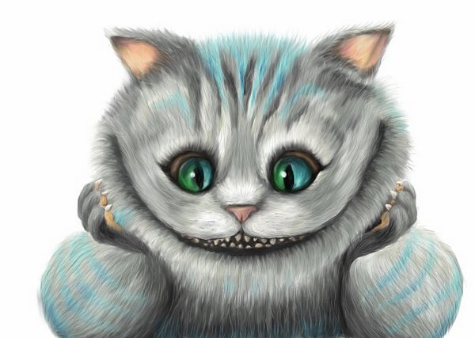

**Глубина цвета**

Кроме размера изображения, важной является информация о количестве цветов, закодированных в файле.

Глубина цвета определяет то количество оттенков, в диапазоне которых точка может изменять свой цвет.

Цвет каждого пиксела кодируется определенным числом бит (bit), то есть элементарных единиц информации, с которыми может иметь дело компьютер. Каждый бит может принимать два значения -- 1 или 0. В зависимости от того, сколько бит отведено для цвета каждого пиксела, возможно кодирование различного числа цветов. Нетрудно сообразить, что если для кодировки отвести лишь один бит, то каждый пиксел может быть либо белым (значение 1), либо черным (значение 0). Такое изображение называют монохромным (monochrome).

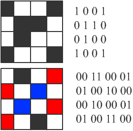

Далее, если для кодировки отвести четыре бита, то можно закодировать 24=16 различных цветов, отвечающих комбинациям бит от 0000 до 1111. Если отвести 8 бит - то такой рисунок может содержать 28=256 различных цветов (от 00000000 до 11111111), 16 бит - 216=65 536 различных цветов (так называемый High Color). И, наконец, если отвести 24 бита, то рисунок может содержать 224=16 777 216 различных цветов и оттенков. В последнем случае кодировка называется 24-bit True Color. Но даже если в файле и отводится 24 бита на каждый пиксел, это еще не означает, что вы действительно сможете насладиться такой богатой палитрой - ведь технические возможности мониторов ограничены.

**Цветовая палитра**

Палитра — ограниченный набор цветов, который позволяет отобразить графическую систему компьютера.

Из широкого цветового пространства выбираются любые N цветов, и их координаты (обычно: R, G и B) хранятся в специальной таблице — палитре. Данные растровой графики, использующие палитру, представляют собой массив, где хранятся номера (индексы) цветов в палитре.

Палитровая графика позволяет совместить широкий цветовой охват изображения с невысоким расходом памяти.

*Индексированный цвет* - это способ переопределения палитры цветов в изображении для задания наиболее часто использующихся цветов и экономии дискового пространства при создании выходного файла. Активно используется в файлах формата GIF. Этот механизм был придуман для того, чтобы в изображениях, содержащих всего несколько цветов (например, логотипы, где используется обычно несколько фирменных цветов и не используются другие) можно было задать только их путем программирования палитры данного изображения.

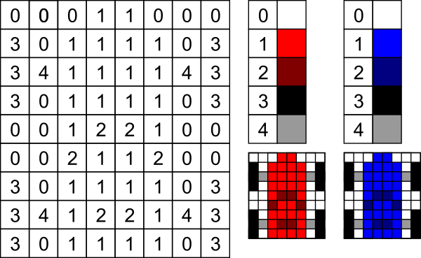

**True color**

С увеличением количества бит в представлении цвета, количество отображаемых цветов стало непрактично большим для цветовых палитр (20-битная глубина цвета требует больше памяти для сохранения цветовой палитры, чем памяти для сохранения самих пикселей изображения). При большой глубине цвета на практике обычно кодируют яркости красной, зелёной и синей составляющих — такое кодирование обычно называют [RGB-моделью](graphics.md#rgb).

**Плюсы растрового изображения**
- высокая реалистичность изображения;
- растровая графика позволяет воспроизвести изображение любой сложности;

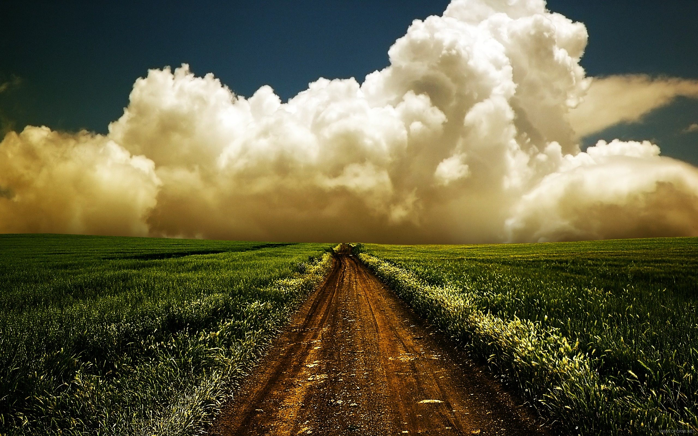

**Недостатки растровых изображений**
- растровые изображения плохо масштабируются, можно уменьшить изображение, однако увеличить его без потери качества невозможно (к потере качества относится заметное увеличение размытия изображения после увеличения рисунка);

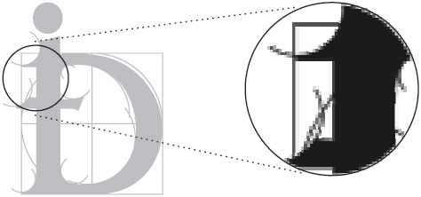

- растровое изображение можно редактировать только целиком (в отличие от векторного, его нельзя разбить на части);
- конечный размер картинки зависит от количества пикселей, т.е. от разрешения изображения. Поэтому, зачастую, файл с растровым изображением имеет больший размер по сравнению с векторным.

Например, это изображение


в векторе - 1.98 KБ, а в растре - 51 КБ

### Перевод изображений

Трансформация из вектора в растр достаточно дешёвая и простая операция. Обратная же транфсмормация (называемая *трассировкой*) чаще всего происходит некорректно и с большими затратами процессорного времени.

## Цветовые модели

Цветовая модель — термин, обозначающий абстрактную модель описания представления цветов в виде кортежей чисел, обычно из трёх или четырёх значений, называемых цветовыми компонентами или цветовыми координатами. Вместе с методом интерпретации этих данных множество цветов цветовой модели определяет цветовое пространство.

### RGB

RGB-модель - наиболее распространенный способо кодирования цвета. При этом способе кодирования любой цвет представляется в виде комбинации трех цветов (каналов): красного (Red), зеленого (Green) и синего (Blue), взятых с разной интенсивностью.

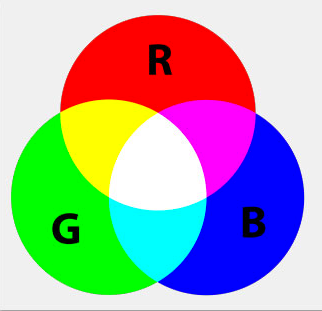

Интенсивность каждого из трех цветов -- это один байт (т. е. число в диапазоне от 0 до 255):

белый цвет можно записать в следующем виде:
- R - 255
- G - 255
- B - 255

чёрный: R - 0, G - 0, B - 0
красный: R - 255, G - 0, B - 0
желтый: R - 255, G - 255, B - 0.

```
#text {
    color: rgb(0, 0, 0);
}
```

Также допустимо задавать цвет в процентном отношении, при этом 100% будет соответствовать числу 255:

```
body {
    color: rgb(100%, 50%, 50%);
}
```

Кроме того, rgb хорошо представляется двумя 16-ричными цифрами (числом от 00 до FF). Таким образом, цвет удобно записывать тремя парами 16-ричных цифр:

- белый - `#ffffff`
- красный - `#ff0000`
- черный - `#00000`
- желтый - `#ffff00`

```
a:hover {
    color: #ff0000;
}
```

Такой формат записи называется `HEX`. Если оба числа каждый пары одинаковы (например, в первой паре `ff`), то допускается использовать в hex-записи по одному числу вместо пары. Например, `#ff00cc` можно записать, как `#f0c`.

Для того, чтобы получить более темный желтый цвет, надо одинаково уменьшить интенсивности красного и зеленого - `A7A700`.


Чем больше значение байта цветовой составляющей, тем ярче этот цвет. При наложении одной составляющей на другую яркость суммарного цвета также увеличивается.

**Функциональные нотации rgb() и rgba()**

Эти нотации позволяют указывать RGB-палитру, используя десятичные значения. `rgb()` принимает на вход указанные через запятую степени заполнения каждого из каналов. Например, для красного цвета:
`color: rgb(255, 0, 0);

 `rgba()` отличает от `rgb()` возможность указания альфа-канала (степень прозрачности цвета). Альфа-канал указывается в виде десятичной дроби в диапазоне от 0 до 1, где 0 соответствует полной прозрачности, а 1 — непрозрачности.

```
#text {
    color: rgb(0, 0, 0, .8);
}
```

*sRGB* является стандартом представления цветового спектра с использованием модели RGB. sRGB создан совместно компаниями HP и Microsoft в 1996 году для унификации использования модели RGB в мониторах, принтерах и Интернет-сайтах.

**Имена цветов**

В CSS существует 140 именованных цветов. Например, `red`, `black`, `green` и др. Такие имена можно использовать для
указания цвета:

```
body {
    color: red;
    border-color: green;
}
```

Кодирование каждого именованного цвета описано в стандартах. Например, `red` соответствует `#f00`.

### CMYK

В отличие от модели RGB, модель CMY описывает цвета, полученные в результате отражения света объектами, то есть полностью противоположна предыдущей. Данная модель является субтрактивной (вычитающей), поскольку цвета в ней образуются путем вычитания из черного цвета базовых цветов: голубого (Cyan), пурпурного (Magenta), желтого (Yellow).

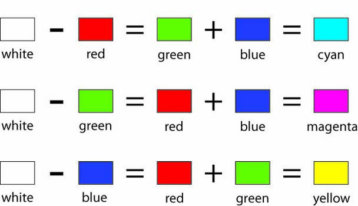

Они образуют так называемую полиграфическую триаду и называются триаднымитриадные цвета. В цветовой модели CMY уровень составляющих задается значениями в диапазоне от 0 до 100 (величина 100 в этой модели соответствует 255 единицам модели RGB), где эти числа называются "частями" или "пропорциями". Поскольку цветовая модель CMY является обратной модели RGB, то при смешивании двух субтрактивных цветов результирующий цвет оказывается более темным, чем исходные, а при смешивании всех трех составляющих должен получаться черный цвет. Соответственно белый цвет — это полное отсутствие краски (значения всех цветовых составляющих равны 0).


Может показаться, что такая модель больше всего подходит для печатной продукции — ведь мы видим цвет, отраженный от поверхности. Однако модель CMY не годится для печатных процессов, так как на практике ничего идеального не бывает. Теоретически смесь трех базовых красок должна давать глубокий черный цвет, но в реальности так не получается, поскольку при смешивании данных трех красок образуется не черный, а грязно-коричневый цвет. Для устранения этого недостатка к трем краскам добавили четвертую, черную (Black), и цветовая модель получила название CMYK — Cyan, Magenta, Yellow, BlacK. В слове Black используется не первая буква, а последняя, чтобы не путать с цветом Blue модели RGB. Таким образом, черный цвет в модели CMYK образуется с помощью только одной составляющей — черной (0,0,0,100), хотя иногда применяется и более глубокий черный. Область применения цветовой модели CMYK — полноцветная печать. Именно с этой моделью работает большинство устройств печати.

### HSL и HSV

Эти две модели мы обединили, потому что они схожи по своему принципу.

Трехмерная реализация HSL (слева) и HSV (справа) моделей представлена ниже:

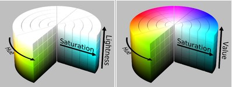

HSV (или HSB) означает Hue, Saturation, Value (еще может именоваться Brightness), где:

- Hue — цветовой тон, т.е. оттенок цвета.
- Saturation — насыщенность. Чем выше этот параметр, тем «чище» будет цвет, а чем ниже, тем ближе он будет к серому.
- Value (Brightness) — значение (яркость) цвета. Чем выше значение, тем ярче будет цвет. А чем ниже, тем темнее (0% — черный)

HSL — Hue, Saturation, Lightness:

- Hue — цветовой тон, т.е. оттенок цвета.
- Saturation — насыщенность. Аналогично с HSV.
- Lightness — это светлота цвета (не путать с яркостью). Чем выше параметр, тем светлее цвет (100% — белый), а чем ниже, тем темнее (0% — черный).

Более распространенная модель — HSV, она часто используется вместе с моделью RGB, где HSV показана в визуальном виде, а числовые значения задаются в RGB.


Здесь RGB-модель обведена красным и значения оттенков задаются числами от 0 до 255, либо сразу можно указать цвет в шестнадцатеричном виде. А синим обведена HSV модель (визуальная часть в левом прямоугольнике, числовая — в правом).

Такая модель чаще всего используется в простой обработке изображений, т.к. при помощи неё удобно регулировать основные параметры фотографий, не прибегая к куче различных фильтров или отдельных настроек.
Например, в фотошопе присутствуют обе модели, только одна из них находится в редакторе выбора цвета, а другая — в окне настроек Hue/Saturation.

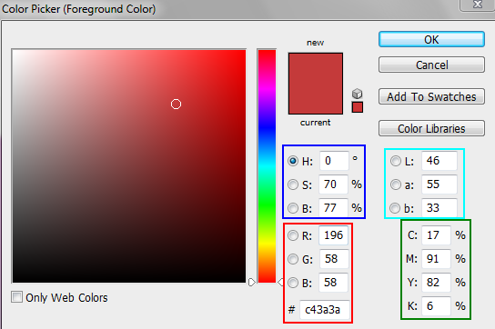

Здесь красным показа RGB-модель, синим — HSB, зеленым — CMYK и голубым Lab (о ней чуть позже).

А HSL-модель находится в таком вот окошке:

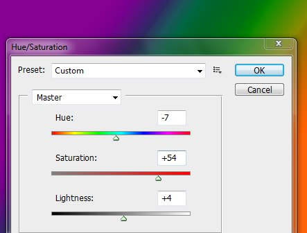

Существует возможность задать цвет HSL в CSS

```
body {
    color: hsl(120,100%,25%); // зеленый
    background-color: hsl(60,100%,50%); // желтый
}
```

Формат HSLA похож по синтаксису на HSL, но включает в себя альфа-канал, задающий прозрачность элемента. Значение 0 соответствует полной прозрачности, 1 — непрозрачности, а промежуточное значение вроде 0.5 — полупрозрачности.


```
div {
    background-color: hsl(60,100%,25%);
    color: hsla(120,100%,50%,0.1);
}
```

Недостаток HSB-модели в том, что она также зависит от аппаратной части. Она просто не соответствуют восприятию человеческого глаза, т.к. он воспринимает цвета с разной яркостью (например, синий воспринимается более темным, чем красный), а в этой модели у всех цветов одинаковая яркость. У HSL аналогичные недостатки.

Именно во избежание таких недостаков была придумала новая модель, названная Lab.

### LAB

Цветовая модель Lab была разработана Международной комиссией по освещению (CIE) для устранения недостатка вышеописанных цветовых моделей. Эта модель является одной из стандартных, хотя и малоизвестна. Её цветовой охват максимально близок к восприятию человека с нормальным зрением.

Расшифровывается она следующим образом:

- L — Luminance — освещенность (это совокупность яркости и интенсивности)
- a — один из компонентов цвета, меняется от зеленого до красного
- b — второй из компонентов цвета, меняется от синего до желтого

На рисунке показаны диапазоны компонент a и b для освещенности 25% (слева) и 75% (справа)

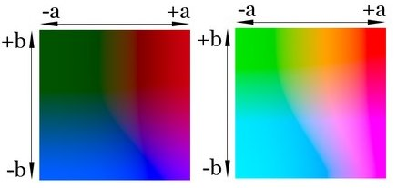

Яркость в этой модели отделяется от цветов, поэтому при помощи неё удобно регулировать контраст, резкость и другие светопоказатели, не трогая при этом цвета.


## Форматы векторной графики

### SVG

[Спецификация SVG](http://www.w3.org/TR/SVG11/)
[Про SVG в MDN](https://developer.mozilla.org/ru/docs/Web/SVG)

SVG (Scalable Vector Graphics) — язык разметки масштабируемой векторной графики, созданный Консорциумом Всемирной паутины (W3C) и входящий в подмножество расширяемого языка разметки XML, предназначен для описания двумерной векторной и смешанной векторно/растровой графики в формате XML. Поддерживает как неподвижную, так анимированную и интерактивную графику — или, в иных терминах, декларативную и скриптовую. Это открытый стандарт, является рекомендацией консорциума W3C. Разрабатывается с 1999 года, в 2011 году вышла 1.1 версия, которая остается актуальной до сегодняшнего дня, в активной разработке версия 1.2. В основу SVG легли языки разметки VML и PGML.

Отображением (форматированием и декорированием) SVG элементов можно управлять с помощью таблицы стилей CSS 2.0 и её расширений, либо напрямую с помощью атрибутов SVG элементов.

Достоинством svg является еще и то, что это по сути текстовый файл и при наличии определенных навыков возможно редактировать и создавать векторное изображение в обычном текстовом редакторе.

Файл SVG изображения имеет расширение .svg или .svgz, описывается по всем синтаксическим правилам XML, а именно:
1. Начинается  с заголовка (объявления XML) и указания DOCTYPE (не обязательно), например:
```
<?xml version="1.0" encoding="UTF-8"?>
<!DOCTYPE svg PUBLIC "-//W3C//DTD SVG 1.1//EN" "http://www.w3.org/Graphics/SVG/1.1/DTD/svg11.dtd">
```
2. Продолжается объявлением корневого элемента (в данном случае - `<svg>`). Этот элемент является непосредственным холстом рисунка, в параметрах задается пространство имен, ширина, высота документа.
```
<?xml version="1.0" encoding="utf-8" standalone="yes"?>
<svg xmlns="http://www.w3.org/2000/svg" version="1.1" height = "400px"  width = "400px">
</svg>
```
3. Внутри корневого элемента вставляются элементы (теги), описывающие само изображение.
```
<?xml version="1.0" encoding="utf-8" standalone="yes"?>
<svg xmlns="http://www.w3.org/2000/svg" version="1.1" height = "400px"  width = "400px">
        <circle cx="100px" cy="100px" r="100px" fill="red" />
        <circle cx="150px" cy="150px" r="100px" fill="blue" />
        <circle cx="200px" cy="200px" r="100px" fill="green" />
</svg>
```
4. Каждому тегу могут быть присвоены атрибуты. В зависимости от атрибутов тега, фигура, описываемая этим тегом, будет иметь те или иные свойства (положение по оси X и Y, цвет фона, рамки и т.д.).
```
<circle cx="100px" cy="100px" r="100px" fill="red" style="fill-opacity: 0.5" />
```
Тег circle имеет 4 параметра:
 - cx, cy - координаты по оси X и Y. Координаты отчисляются с верхнего левого угла (это 0-0).
 - r - радиус
 - fill - цвет заливки
 - style - стиль элемента (в данном случае - прозрачность 0.5).

У каждого тега могут быть свои уникальные атрибуты и общие для всех. Посмотреть подробнее можно в спецификации: [базовые фигуры](http://www.w3.org/TR/SVG11/shapes.html), [paths](http://www.w3.org/TR/SVG11/paths.html) и [текст](http://www.w3.org/TR/SVG11/text.html)

Для примера работы, следующий код будет задавать такую картинку
```
<?xml version="1.0" encoding="utf-8" standalone="yes"?>
<svg xmlns="http://www.w3.org/2000/svg" version="1.1" height = "400px"  width = "400px">
        <circle cx="100px" cy="100px" r="100px" fill="red"  style="fill-opacity: 0.5" />
        <circle cx="150px" cy="150px" r="100px" fill="blue" style="fill-opacity: 0.5" />
        <circle cx="200px" cy="200px" r="100px" fill="green" style="fill-opacity: 0.5" />
        <rect x="0" y="0" width="100" height="100" fill="black" stroke="black" stroke-width="5px" />
</svg>
```


В HTML5 была внедрена inline поддержка SVG, таким образом, рисунок может быть вставлен на странице как обычный тег (`<svg>...</svg>`).

Любому элементу могут быть присовены фильтры:

- `translate` - перенести
- `rotate` - повернуть
- `scale` - масштабировать
- `scewX`, `scewY` - исказить
- `matrix` - смешанная трансформация

Все эти фильтры описываются в атрибуте `transform`.

Например, овал, повернутый на 30 градусов, перемещенный на 100-200 и уменьшенный в 2 раза
```
<?xml version="1.0" standalone="no"?>
<svg width="12cm" height="4cm" viewBox="0 0 1200 400" xmlns="http://www.w3.org/2000/svg" version="1.1"> <ellipse cx="100" cy="200" transform="rotate(-30) translate(100 200) scale(0.5)" rx="250" ry="100" fill="none" stroke="blue" stroke-width="20"  />
</svg>
```
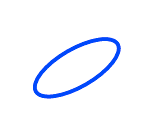

Для каждого элемента SVG можно описать свой сценарий на языке SMIL. Сценарий описывается тегом `amimate`. Почитать подробнее можно [здесь](http://graphing.ru/i/svg-animation/) и в [спецификации](http://www.w3.org/TR/SVG11/animate.html).

**Поддержка браузерами**

В настоящий момент формат SVG поддерживается 96.43% браузеров:
* 94.35% - полная поддержка
* 2.08%	- частичная (Android Browser 3/4)

Не поддерживается IE8.

### ... другие векторные форматы

Кроме SVG существуют и другие векторные форматы ([список](https://ru.wikipedia.org/wiki/Графические_форматы)). Вот некоторые из них:
* EPS
* CDR
* WMF
* AI
* FLA/SWF

**EPS**

*Encapsulated PostScript (EPS)* — расширение формата PostScript, данные в котором записываются в соответствии со стандартом DSС (англ. Document Structuring Conventions), но при этом c рядом расширений, позволяющих использовать этот формат как графический.

Формат EPS был создан компанией Adobe на основе языка PostScript и послужил базой для создания ранних версий формата Adobe Illustrator.

В своей минимальной конфигурации EPS-файл имеет так называемый BoundingBox DSC comment — информацию, описывающую размер изображения. Таким образом, даже если приложение не может растеризовать данные, содержащиеся в файле, оно имеет доступ к размерам изображения и его preview.

Формат может содержать растровые изображения, векторные изображения, а также их комбинации.

Структура данных растрового EPS-файла может быть записана разными методами: ASCII-данные (текстовые данные), Binary (двоичные данные) и JPEG с различной степенью сжатия.

Preview EPS-файла также может быть создано с использованием различных методов уменьшения объёма данных: JPEG, TIFF (1/8 bit).

**CDR**

*CDR* — векторное изображение или рисунок, созданный с помощью программы CorelDRAW. Данный формат файла разработан компанией Corel для использования в собственных программных продуктах. CDR-файлы не поддерживаются многими программами, предназначенными для редактирования изображений. Однако, файл можно экспортировать с помощью CorelDRAW в другие, более распространенные и популярные форматы изображений.

**WMF**

*WMF (англ. Windows MetaFile)* — универсальный формат векторных графических файлов для Windows приложений. Формат разработан Microsoft и является неотъемлемой частью Windows, так как сохраняет последовательность аппаратно-независимых функций GDI (Graphical Device Interface), непосредственно выводящих изображение в заданный контекст графического устройства (на экран, на принтер и т.п.). Очень часто WMF неявно используется для сохранения образа окна вывода программы и его последующего восстановления, а также при переносе информации через буфер обмена (clipboard). Из MS Windows запись и чтение в файл этого формата осуществляются чрезвычайно просто и быстро, в других операционных системах поддержка этого формата бесполезна. Его понимают некоторые программы для Macintosh. На платформе Macintosh аналогичную роль играет формат PICT.

**AI**

*Adobe Illustrator*. Являясь частью семейства Adobe, поддерживают практически все программы, так или иначе связанные с векторной графикой. Лучший посредник при передаче изображений из одной программы в другую. Отличается наибольшей стабильностью и совместимостью с языком PostScript.

**FLA/SWF**

*SWF (ShockWaveFlash)* - формат Flash, продукт компании «Macromedia», позволяющий разрабатывать интерактивные мультимедийные приложения. Сфера использования Flash различна, это могут быть игры, веб-сайты, презентации, баннеры и просто мультфильмы. При создании продукта можно использовать медиа, звуковые и графические файлы, можно создавать интерактивные интерфейсы и полноценные веб-приложения с использованием PHP и XML.

*FLA* - внутренний формат программы для создания интерактивной анимации Flash.

## Форматы растровой графики

### BMP
*BMP* (от англ. Bitmap Picture) — формат хранения растровых изображений. Изначально формат мог хранить только аппаратно-зависимые растры (англ. Device Dependent Bitmap, DDB), но с развитием технологий отображения графических данных формат BMP стал преимущественно хранить аппаратно-независимые растры (англ. Device Independent Bitmap, DIB).

С форматом BMP работает огромное количество программ, так как его поддержка интегрирована в операционные системы Windows и OS/2. Файлы формата BMP могут иметь расширения .bmp, .dib и .rle.

Изображение в формате BMP:

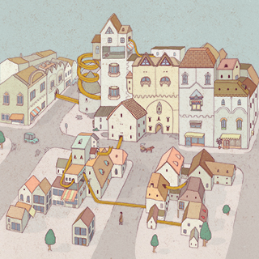

Глубина цвета в данном формате может быть от 1 до 24 бит на пиксел, максимальные размеры изображения 65535x65535 пикселов.

В формате BMP есть поддержка сжатия по алгоритму [RLE](graphics.md#Алгоритмы-сжатия-без-потерь), однако теперь существуют форматы с более сильным сжатием, и из-за большого объёма BMP редко используется в Интернете, где для сжатия без потерь используются [PNG](graphics.md#png) и более старый GIF.

Разрабатывался фирмой Microsoft как совместимый со всеми приложениями Windows. В формате BMP можно сохранять черно-белые, серые полутоновые, индексные цветные и цветные изображения системы RGB (но не двухцветные или цветные изображения системы [CMYK](graphics.md#cmyk)). Недостаток этих графических форматов: большой объем. Следствие - малая пригодность для использования в вебе.

### GIF

*GIF(англ. Graphics Interchange Format — формат для обмена изображениями)* — формат хранения графических изображений. Формат GIF способен хранить сжатые данные без потери качества в формате не более 256 цветов. Независящий от аппаратного обеспечения формат GIF был разработан в 1987 году (GIF87a) фирмой CompuServe для передачи растровых изображений по сетям. В 1989-м формат был модифицирован (GIF89a), были добавлены поддержка прозрачности и анимации. GIF использует LZW-компрессию, что позволяет неплохо сжимать файлы, в которых много однородных заливок (логотипы, надписи, схемы).

GIF широко используется в вебе.

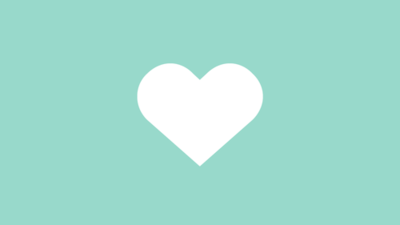

Изображение в формате GIF хранится построчно, поддерживается только формат с индексированной палитрой цветов. Стандарт разрабатывался только для поддержки 256-цветовой палитры.

Один из цветов в палитре может быть объявлен «прозрачным». В этом случае в программах, которые поддерживают прозрачность GIF (например, большинство современных браузеров) сквозь пиксели, окрашенные «прозрачным» цветом, будет виден фон. «Полупрозрачность» пикселей (технология альфа-канала) не поддерживается.

**Чересстрочный GIF**

Формат GIF допускает чересстрочное хранение данных (*Interlaced GIF*). При этом строки разбиваются на группы, и меняется порядок хранения строк в файле. При загрузке изображение проявляется постепенно, в несколько проходов. Благодаря этому, имея только часть файла, можно увидеть изображение целиком, но с меньшим разрешением.

В чересстрочном GIF’е сначала записываются строки 1, 5, 9 и т. д. Таким образом, загрузив 1/4 данных, пользователь будет иметь представление о целом изображении. Вторым проходом следуют строки 3, 7, 11, разрешение изображения в браузере ещё вдвое увеличивается. Наконец, третий проход передаёт все недостающие строки (2, 4, 6…). Таким образом, задолго до окончания загрузки файла пользователь может понять, что внутри и решить, стоит ли ждать полной загрузки изображения. Чересстрочная запись незначительно увеличивает размер файла, но это, как правило, оправдывается приобретаемым свойством.

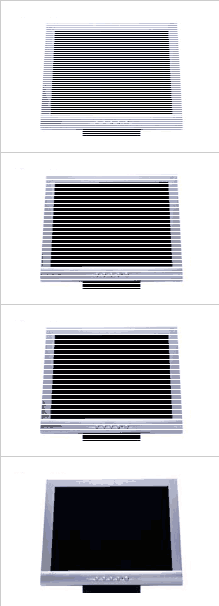

**Анимированные изображения**

Формат GIF поддерживает анимационные изображения. Фрагменты представляют собой последовательности нескольких статичных кадров, а также информацию о том, сколько времени каждый кадр будет показан на экране. Анимация может быть закольцована, тогда после последнего кадра будет вновь показан первый и так далее.


**Сжатие**

GIF использует формат сжатия LZW. Таким образом, хорошо сжимаются изображения, строки которых имеют повторяющиеся участки. Например, изображения в которых много пикселей одного цвета по горизонтали.

### TIFF

*TIFF (Tagged Image File Format)* создан обьединенными силами Aldus, Microsoft и Next специально для хранения сканированных изображений. Исключительная гибкость формата сделала его действительно универсальным. ТIFF - один из самых древних форматов в мире микрокомпьютеров, на сегодняшний день он является самым гибким, универсальным и активно развивающимся. В нем можно хранить графику в любом режиме: от битового и индексированных цветов до Lab, CMYK и RGB (кроме дуплексов и многоканальных документов).

Хотя с момента его создания прошло уже много времени, TIFF до сих пор является основным форматом, используемым для хранения сканированных изображений. Версии формата существуют на всех компьютерных платформах, что делает его исключительно удобным для переноса растровых изображений между ними. TIFF поддерживает монохромные, индексированные, полутоновые и полноцветные изображения в моделях RGB и CMYK с 8- и 16-битными каналами. Он позволяет хранить обтравочные контуры, калибровочную информацию, параметры печати.

Большим достоинством формата остается поддержка практически любого алгоритма сжатия. Наиболее распространенным является сжатие без потерь информации по алгоритму [LZW](graphics.md#Алгоритмы-сжатия-без-потерь) (Lempel Ziv Welch), обеспечивающему очень высокую степень компрессии.

Изображение *.tiff

**Сжатие**

Имеется возможность сохранять изображение в файле формата TIFF со сжатием и без сжатия. Степени сжатия зависят от особенностей самого сохраняемого изображения, а также от используемого алгоритма. Формат TIFF позволяет использовать следующие алгоритмы сжатия:
- [PackBits (RLE)](graphics.md#Алгоритмы-сжатия-без-потерь)
- [Lempel-Ziv-Welch (LZW)](graphics.md#Алгоритмы-сжатия-без-потерь)
- LZ77
- [ZIP](graphics.md#Алгоритмы-сжатия-без-потерь)
- JBIG
- [JPEG](graphics.md#Алгоритмы-сжатия-с-потерями)
- [CCITT](graphics.md#Алгоритмы-сжатия-без-потерь)

При этом JPEG является просто инкапсуляцией формата JPEG в формат TIFF. Формат TIFF позволяет хранить изображения, сжатые по стандарту JPEG, без потерь данных (JPEG-LS).

### JPEG

*JPEG (произносится «джейпег», англ. Joint Photographic Experts Group, по названию организации-разработчика)* — один из популярных графических форматов, применяемый для хранения фотоизображений и подобных им изображений. Файлы, содержащие данные JPEG, обычно имеют расширения .jpeg, .jfif, .jpg, .JPG, или .JPE. Однако из них .jpg самое популярное расширение на всех платформах.

Изображение в формате JPEG:


Алгоритм JPEG является алгоритмом сжатия данных с потерями.

**Область применения**

Алгоритм JPEG в наибольшей степени пригоден для сжатия фотографий и картин, содержащих реалистичные сцены с плавными переходами яркости и цвета. Наибольшее распространение JPEG получил в цифровой фотографии и для хранения и передачи изображений по сети.

Уменьшение размера файла достигается сложным математическим алгоритмом удаления информации - чем заказываемое качество ниже, тем коэффициент сжатия больше, файл меньше. Главное, подобрать максимальное сжатие при минимальной потере качества. Последний идентифицирует и отбрасывает данные, которые человеческий глаз не в состоянии увидеть (незначительные изменения в цвете не различаются человеком, тогда как улавливается даже малейшая разница в интенсивности, поэтому JPEG меньше подходит для обработки черно-белых полутоновых изображений), что приводит к существенному уменьшению размера файла.

Степень искажения зависит от выставленного уровня сжатия от 1 до 100%:

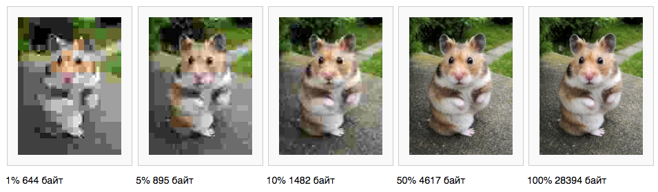

Таким образом, в отличие от метода сжатия LZW или RLE в результате применения технологии JPEG данные теряются навсегда. Так, файл, однажды записанный в формате JPEG, а затем переведенный, скажем, в TIFF, уже не будет тем же, что и оригинал.

С другой стороны, JPEG малопригоден для сжатия чертежей, текстовой и знаковой графики, где резкий контраст между соседними пикселами приводит к появлению заметных артефактов. Такие изображения целесообразно сохранять в форматах без потерь, таких как TIFF, GIF, PNG или RAW.

JPEG (как и другие методы искажающего сжатия) не подходит для сжатия изображений при многоступенчатой обработке, так как искажения в изображения будут вноситься каждый раз при сохранении промежуточных результатов обработки.

JPEG сохраненный несколько раз:


JPEG не должен использоваться и в тех случаях, когда недопустимы даже минимальные потери, например, при сжатии астрономических или медицинских изображений. В таких случаях может быть рекомендован предусмотренный стандартом JPEG режим сжатия Lossless JPEG или стандарт сжатия JPEG-LS.

**Достоинства и недостатки**

Недостатки:
- появление на  изображениях при высоких степенях сжатия характерных артефактов: изображение рассыпается на блоки размером 8x8 пикселов (этот эффект особенно заметен на областях изображения с плавными изменениями яркости), в областях с высокой пространственной частотой (например, на контрастных контурах и границах изображения) возникают артефакты в виде шумовых ореолов. Следует отметить, что стандарт JPEG (ISO/IEC 10918-1, Annex K, п. K.8) предусматривает использование специальных фильтров для подавления блоковых артефактов, но на практике подобные фильтры, несмотря на их высокую эффективность, практически не используются. Однако, несмотря на недостатки, JPEG получил очень широкое распространение из-за достаточно высокой (относительно существовавших во время его появления альтернатив) степени сжатия, поддержке сжатия полноцветных изображений и относительно невысокой вычислительной сложности.
- форматом не поддерживаются анимация и прозрачный цвет.

Достоинства:
- Формат JPEG является TrueColor-форматом, то есть может хранить изображения с глубиной цвета 24 бит/пиксел. Такой глубины цвета достаточно для практически точного воспроизведения изображений любой сложности.

- Предназначен для представления сложных фотоизображений. Разновидность progressive JPEG позволяет сохранять изображения с выводом за указанное количество шагов (от 3 до 5 в Photoshop'e) - сначала с маленьким разрешением (плохим качеством), на следующих этапах первичное изображение перерисовывается все более качественной картинкой.

### PNG

PNG (англ. portable network graphics) — растровый формат хранения графической информации, использующий сжатие без потерь по алгоритму Deflate.
PNG был создан как свободный формат для замены GIF, поэтому в Интернете появился бэкроним «PNG’s Not GIF»(«PNG — не GIF»).
Файлы формата PNG имеют расширение .PNG (.png).

Позволяет выбирать палитру сохранения - серые полутона, 256 цветов, true color. Позволяет использовать "прозрачный" цвет, но, в отличие от GIF'a таких цветов может быть до 256. В отличие от GIF сжатие без потери качества производится и по горизонтали и по вертикали (алгоритм собственный, параметры тоже не настраиваемые). Не поддерживает анимацию.

**Область применения**
Формат PNG спроектирован для замены устаревшего и более простого формата GIF, а также, в некоторой степени, для замены значительно более сложного формата TIFF. Формат PNG позиционируется прежде всего для использования в Интернете и редактирования графики.

PNG поддерживает три основных типа растровых изображений:
- Полутоновое изображение (с глубиной цвета 16 бит)
- Цветное индексированное изображение (палитра 8 бит для цвета глубиной 24 бит)
- Полноцветное изображение (с глубиной цвета 48 бит)

Формат PNG хранит графическую информацию в сжатом виде. Причём это сжатие производится без потерь, в отличие, например, от JPEG с потерями.

Формат PNG обладает более высокой степенью сжатия для файлов с большим количеством цветов, чем GIF, но разница составляет около 5-25 %, что недостаточно для абсолютного преобладания формата, так как небольшие 2-16-цветные файлы формат GIF сжимает с не меньшей эффективностью.

PNG является хорошим форматом для редактирования изображений, даже для хранения промежуточных стадий редактирования, так как восстановление и пересохранение изображения проходят без потерь в качестве.

Картинка в PNG:

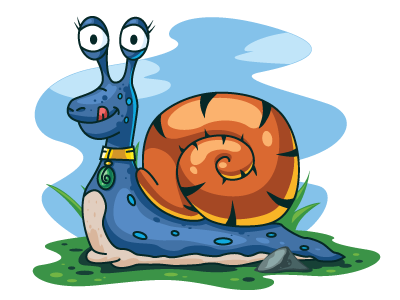

### другие растровые форматы

**WebP**

Формат сжатия изображений с потерями и без потерь качества, предложенный компанией Google Inc. в 2010 году. Основан на алгоритме сжатия неподвижных изображений (ключевых кадров) из видеокодека VP8.

Сжатие состоит из двух этапов. На первом делается попытка «предсказать» содержимое одних блоков по уже декодированным (три блока над текущим и один блок слева от него), на втором кодируется ошибка предсказания. Блоки отрисовываются в порядке слева направо и сверху вниз.

**RAW**

Формат разработан для цифровых фотоаппаратов. Это точная копия картинки, запечатленной на матрице во время съемки, представляет из себя три фотографии, снятые в красных, синих и зеленых цветах.

Расширения RAW-файлов у разных производителей могут отличаться, и их далеко не всегда получается открыть с помощью программ для обработки изображений.

**PCX**

Формат PCX (PC eXchange) - один из первых растровых форматов, созданных фирмой ZSoft для программы PC Paintbrush. Поддерживает монохромные, индексированные и полноцветные изображения модели RGB. Не поддерживаются дополнительные цветовые и альфа-канлалы, управление цветом. Формат предполагает использование простейшего алгоритма сжатия (Run Length Encoding, [RLE](graphics.md#rle)) без потерь информации. Ныне имеет преимущественно историческое значение. Pcx можно посмотреть большинством программ под DOS, в том числе внутренним просмотрщиком Norton Commander.

**TGA**

Довольно старый формат TGA (Targa) был создан компанией Truevision Inc. для графических адаптеров собственного производства ещё в 1984, но в дальнейшем стал популярен на самых разных платформах, особенно в области обработки видео, анимации. Формат поддерживает 24-битное и 32-битные RGB изображения с одним альфа-каналом, а также полутоновые, индексированные и 16-битные RGB изображения без альфа-каналов. Он поддерживает глубину цвета от 8 до 32 бит на пиксель и использует алгоритм компрессии без потерь [RLE](graphics.md#rly).


## Архивация и компрессия

**Архивация, или сжатие графических данных** ("сжатие без потерь"), возможно как для растровой, так и для векторной графики. При этом способе уменьшения данных, программа анализирует наличие в сжимаемых данных некоторых одинаковых последовательностей данных, и исключает их, записывая вместо повторяющегося фрагмента ссылку на предыдущий такой же (для последующего восстановления). Такими одинаковыми последовательностями могут быть пикселы одного цвета, повторяющиеся текстовые данные, или некая избыточная информация, которая в рамках данного массива данных повторяется несколько раз. Например, растровый файл, состоящий из подложки строго одного цвета (например, серого), имеет в своей структуре очень много повторяющихся фрагментов.

**Компрессия (конвертирование) данных** ("сжатие с потерями") - это способ сохранения данных таким образом, при использовании которого не гарантируется (хотя иногда возможно) полное восстановление исходных графических данных. При таком способе хранения данных обычно графическая информация немного 'портится' по сравнению с оригинальной, но этими искажениями можно управлять, и при их небольшом значении ими вполне можно пренебречь. Обычно файлы, сохраненные с использованием этого способа хранения, занимают значительно меньше дискового пространства, чем файлы, сохраненные с использованием простой аривации (сжатия). Как правило, при сохранении данных с использованием компрессии, имеется возможность компромисса между размером выходного файла и его качеством. Понятно, что возможна оптимизация только по одному параметру (чем меньше качество, тем меньше объем выходного файла, и наоборот).

### Алгоритмы сжатия без потерь

**RLE**

*RLE* (Run - length encoding) - метод сжатия данных, при котором одинаковые последовательности одних и тех же байт заменяются однократным упоминанием повторяющегося байта (или целой цепочки байтов), и числа его повторений в исходных данных.

Например, строка типа 0100 0100 0100 0100 0100 0100 0100 0100, описывающая некую группу пикселов будет заменена на запись типа 0100 х 8, и т.д.

Применяется этот тип сжатия в тех случаях, когда изображение имеет большие участки одинакового цвета, цифровое представление которых идентично.

В основном, этот тип сжатия применим для монохромных изображний, сохраненных в цветовой модели Bitmap, где при сжатии данных с его использованием можно добиться наилучших результатов.

Для сжатия других типов данных (в том числе, и не графических) алгоритм применим, но малоэффективен, так как сжимаемые данные должны иметь простую повторяющуюся структуру).

Этот алгоритм имеет еще одно важное преимущество, заключающееся в его относительной простоте, что позволяет быстро производить распаковку из этого формата и упаковку в этот формат.

Этот метод сжатия графических фанных испольуется для файлов формата PSD, BMP и других.


**CCITT**

CCITT Group 3, CCITT Group 4 - два похожих метода сжатия графических данных, работающие с однобитными изображениями, сохраненными в цветовой модели Bitmap.

Основаны на поиске и исключении из исходного изображения дублирующихся последовательностей данных (как в предыдущем типе сжатия, RLE).

Различием является лишь то, что эти алгоритмы ориентированы на упаковку именно растровой графической информации, так как работают с отдельными рядами пикселов в изображении.

Изначально алгоритм был разработан для сжатия данных, передаваемых через факсимильные системы связи (CCITT Group 3), а более совершенная разновидность этого метода архивации данных (CCITT Group 4) подходит для записи монохромных изображений с более высокой степенью сжатия.

Этот алгоритм подходит для сжатия изображений с большими одноцветными областями. Его достоинством является скорость выполнения, а недостатком - ограниченность применения для компрессии графических данных (не все данные удается таким образом эффективно сжать).

Этот метод сжатия графических фанных испольуется в файлах формата PDF, PostScript (в инкапсулированных объектах) и других.

**LZW**

*LZW (Lemple-Zif-Welch)* - алгоритм сжатия данных, основанный на поиске и замене в исходном файле одинаковых последовательностей данных, для их исключения, и уменьшения размера 'архива'. Относится к формату сжатия без потерь.

Данный тип сжатия подходит для обработки растровых данных любого типа - монохромных, черно - белых, или полноцветных.

Сжимает данные путём поиска одинаковых последовательностей (они называются фразы) во всем файле. Выявленные последовательности сохраняются в таблице, им присваиваются более короткие маркеры (ключи). Так, если в изображении имеются наборы из розового, оранжевого и зелёного пикселов, повторяющиеся 50 раз, LZW выявляет это, присваивает данному набору отдельное число (например, 7) и затем сохраняет эти данные 50 раз в виде числа 7. Метод LZW, так же, как и RLE, лучше действует на участках однородных, свободных от шума цветов, он действует гораздо лучше, чем RLE, при сжатии произвольных графических данных, но процесс кодирования и распаковки происходит медленнее.

Этот метод сжатия графических данных испольуется в файлах формата TIFF, PDF, GIF, PostScript (в инкапсулированных объектах) и других.

**ZIP**

ZIP - метод сжатия данных, аналогичный методу, использованному в популярном алгоритме архивации PKZip.

В основу метода сжатия положен метод, аналогичный LZW. Как и предыдущий метод сжатия данных, этот способ не вносит искажений в исходный файл (сжатие без потерь), и лучше всего подходит для обработки графических данных с одинаковыми одноцветными или повторяющимися областями.

Этот метод сжатия графических фанных испольуется в файлах формата PDF, TIFF и некоторых других.

### Алгоритмы сжатия с потерями

**JPEG**

JPEG (Joint Photographic Experts Group) - метод, используемый для хранения полутоновых и полноцветных изображений, позволяющий добиться наивысшей степени сжатия и минимальный размер выходного файла. Основан алгоритм на особенностях восприятия человеческим глазом различных цветов, и достаточно громоздок с вычислительной точки зрения, так как занимает много процессорного времени.

Происходит кодирование файла в несколько этапов:
- изображение условно разбивается на несколько цветовых каналов
- изображение разбивается на группы, по 64 пиксела в каждой группе, которые представляют из себя квадратные участки изображения размером 8х8 пикселов
- цвет пикселов специальным образом кодируется, исключается дублирующая и избыточная информация, причем при описании цвета большее внимание уделяется скорее яркостной, чем цветовой составляющей, так как человеческий глаз воспринимает больше изменения яркости, чем конкретного цветового тона
- полученные данные сжимаются по RLE или LZW - алгоритму, для получения еще большей компрессии.

В результате, на выходе мы получаем файл, иногда в десятки раз меньший, чем его неконвертированный аналог. Однако, чем меньше размер выходного файла, тем меньше степень 'аккуратности' при работе программы - конвертора, и, соответственно, ниже качество выходного изображения.

Обычно, в программах, позволяющих сохранять растровые данные, возможно задание некоего компромисса между объемом выходного файла и качеством изображения. При наивысшем качестве, обхем выходного файла в 3-5 раз меньше исходного незапакованного. При наименьшем - меньше исходника в десятки раз, но, как правило, при этом качество изображения не позволяет его где-либо использовать.


Этот метод сжатия графических фанных испольуется в файлах формата PDF, PostScript (в инкапсулированных объектах), собственно, в JPEG и других.

**JPEG 2000**

*JPEG 2000 (или jp2)* — графический формат, который вместо дискретного косинусного преобразования, характерного для JPEG, использует технологию вейвлет-преобразования, основывающуюся на представлении сигнала в виде суперпозиции некоторых базовых функций — волновых пакетов.

В результате такой компрессии изображение получается более гладким и чётким, а размер файла по сравнению с JPEG при одинаковом качестве уменьшается ещё на 30 %.

JPEG 2000 полностью свободен от главного недостатка своего предшественника: благодаря использованию вейвлетов, изображения в этом формате не содержат знаменитой «решётки» из блоков по 8 пикселей. Новый формат также, как и JPEG, поддерживает так называемое «прогрессивное сжатие», позволяющее по мере загрузки видеть сначала размытое, но затем всё более чёткое изображение.

Основные преимущества JPEG 2000 по сравнению с JPEG:

1. Большая степень сжатия: артефакты незначительны. Большая степень сжатия достигается благодаря использованию дискретного вейвлет-преобразования и более сложного энтропийного кодирования.
2. Возможность последовательной сборки: JPEG 2000 обеспечивает возможность последовательного декодирования и вывода изображения сверху вниз без необходимости буферизации всего изображения.
3. Гибкий формат файла: форматы файлов JP2 и JPX обеспечивают хранение информации о цветовых пространствах, метаданных и информации для согласованного доступа в сетевых приложениях, взаимодействующих с помощью протокола JPEG Part 9 JPIP.

## Оптимизация

Под оптимизацией изображений для веба обычно понимают их минификацию.

**Оптимизация векторных изображений**

На примере SVG.

```
<?xml version="1.0" encoding="utf-8"?>
<!-- Generator: Adobe Illustrator 17.1.0, SVG Export Plug-In . SVG Version: 6.00 Build 0)  -->
<svg version="1.2" baseProfile="tiny" id="Layer_1" xmlns="http://www.w3.org/2000/svg" xmlns:xlink="http://www.w3.org/1999/xlink"
   x="0px" y="0px" viewBox="0 0 612 792" xml:space="preserve">
<g id="XMLID_1_">
  <g>
    <circle fill="red" stroke="black" stroke-width="2" stroke-miterlimit="10" cx="50" cy="50" r="40"/>
  </g>
</g>
</svg>
```

Пример выше отрисовывает простую круглую форму с черной границей и красным фоном. Это изображние было экспортировано из Adobe Illustrator. Легко догадаться, что оно содержит множество метаданных, например информацию о слоях, комментарии и пространства имен XML, которые чаще всего не нужны для отображения ресурса в браузере.

Принцип работы инструментов оптимизации заключается в удалении «ненужной» информации из SVG, тем самым уменьшается размер самого файла.
Вот некоторые из инструментов для оптимизации SVG:
- SVG Cleaner;
- SVG Scour (для работы необходимо установить Python);
- SVG Optimizer (для работы необходимо установить Node.js).

Для примера, мы можем минифицировать файл SVG, приведенный выше, используя инструмент [svgo](https://github.com/svg/svgo).

```
<svg version="1.2" baseProfile="tiny" xmlns="http://www.w3.org/2000/svg" viewBox="0 0 612 792">
    <circle fill="red" stroke="#000" stroke-width="2" stroke-miterlimit="10" cx="50" cy="50" r="40"/>
</svg>
```

Результат:
```
Done in 53 ms!
0.46 KiB - 58% = 0.193 KiB
```

Например, svgo уменьшает размер приведенного выше файла SVG на 58%: с 470 до 199 Б.

Кроме того, поскольку SVG - это формат на основе XML, мы может применить сжатие GZIP для уменьшения его размера при передаче.

**Оптимизация растровых изображений**

Оптимизация растровых изображений происходит с применением различных методов сжатия.
Можно использовать следующие инструменты:
- tiny - онлайн версию [png](https://tinypng.com/) / [jpeg](https://tinyjpg.com/) или [плагин для Photoshop](https://tinypng.com/photoshop)
- [JPEGmini](http://www.jpegmini.com/)
- (ImageOptim)[https://imageoptim.com/] (для Mac)
- [Imgo](https://github.com/imgo/imgo)

Также уменьшить размер растрового изрбражения можно в момент его сохранения, путем удаления лишней метаинформации.

## Photoshop

Графический редактор - это приложение, созданное для работы с графикой. Вот некоторые из них:
* Adobe Photoshop
* GIMP
* Krita
* Sketch
и другие.

Adobe Photoshop - один из наиболее популярных графических редакторов для создания дизайн-макета для веб-страницы. Разработан фирмой Adobe Systems.
Макеты, созданные в Photoshop имеют расширение *.psd.

### Работа с макетом
Сейчас мы не станем рассматривать полный цикл создания дизайн-макета для сайта или веб-страницы, мы поговорим о том, что делать разработчику с уже готовым макетом.

Первое что мы видим, открыв макет - это направляющие (extras). Они всегда присутствуют в сложном макете.

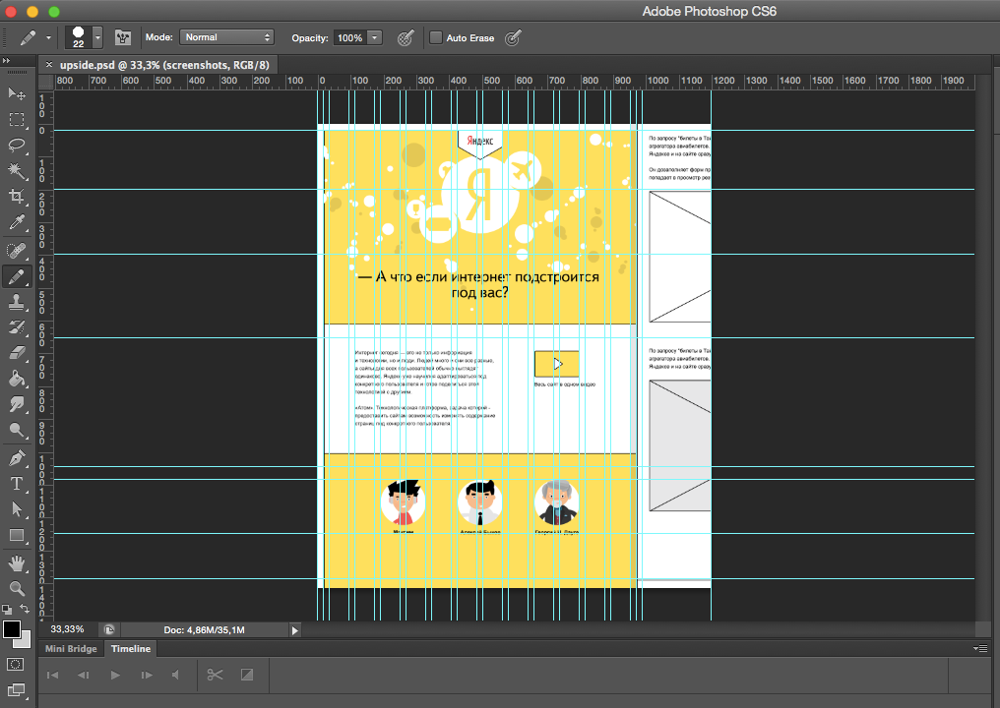

Зачстую, они представляют собой сетку и используются для выравнивания элементов макета.
Чтобы посмотреть на макет отключите их в Меню приложения -> View -> Extras.

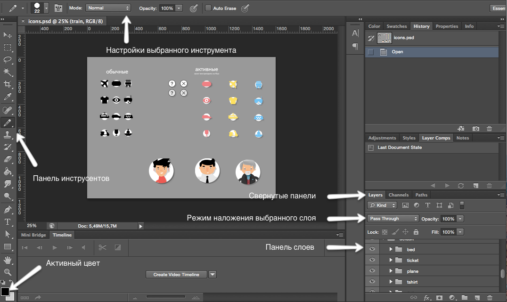

Под меню приложения длинная горизонтальная область — в ней отображаются настройки активного инструмента.

Панель со всеми инструментами слева, прочие панели справа или «плавают».

Внешний вид редактора также настраивается: можно перетаскивать панели, включать и отключать их видимость (в пункте меню приложения - Window), сворачивать и разворачивать (двойной клик по названию панели), сворачивать в иконки.

Создав рабочее окружение с необходимыми панелями и скрыв всё ненужное, можно сохранить вариант получившегося интерфейса. Список рабочих окружений — в верхней правой части окна, в нижней части списка есть пункт «New Workspace...» — нажимаем, именуем, сохраняем.

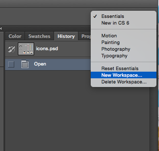

Необходимые и желательные для разработчика панели:

- Layers — панель слоёв — папки и слои макета.
- Character — данные о выделенном текстовом слое или тексте (шрифт, цвет, размер, интерлиньяж и другое).

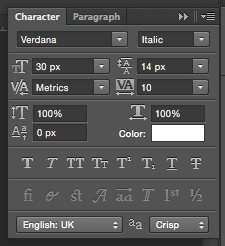

- Info - панель информации. Цвета, положении курсоров по координатам и при выделении - размер выделенного фрагмента.
- History - панель истории

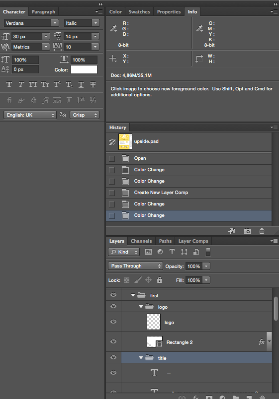

**Настройка панелей**

В панели Info для того, чтобы цвета отображались в привычном для нас виде `HEX`, для цвета выбираем `WebColor`:

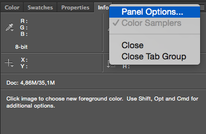

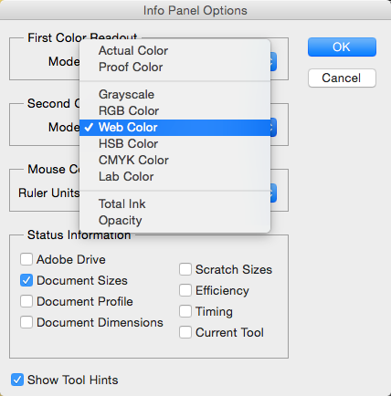

В панели слоев устанавливаем настройку, которая позволяет видеть preview для каждого слоя. Заходим в `Panel Options` выбираем превью побольше (если нужно) и устанавливаем `Thumbnail Contents` равным `Layer Bounds` это позволит нам видеть в preview только содержимое слоя.

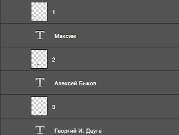 ->

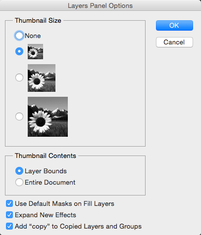 ->

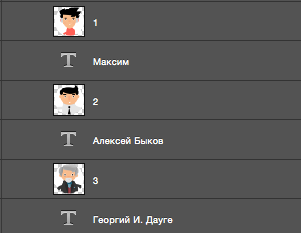

**Горячие клавиши**

Для многих действий в Photoshop существуют горячие клавиши. Горячие клавиши для панели инструментов:

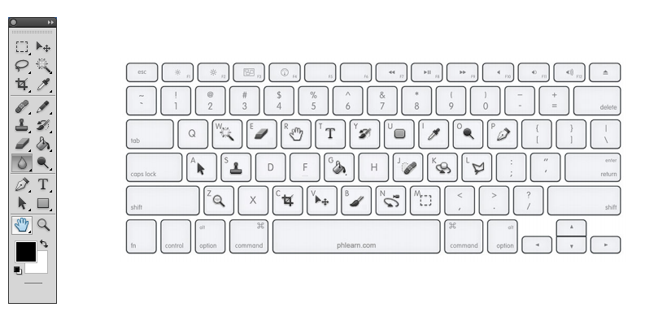

Прочие горячие клавиши:

- ⌘/Ctrl - в сочетании с клавишами '0' (подогнать масштаб под размер окна), '1' (установка масштаба 100%), '+' (увеличение), '-' (уменьшение)
- Alt + клик по инструменту - переключение по меню инструмента
- ⌘/Ctrl+Z - отменить/применить последнее изменение
- ⌘/CTRL+ALT+Z - отмена последних действий (назад по истории)
- Tab - скрывает/открывает сразу все рабочие панели

Это далеко не [полный список](http://www.compartstudio.com/photoshop/hotkey.htm).
При необходимости Photoshop позволяет настроить собственные горячие клавиши - [посмотреть как это сделать](https://helpx.adobe.com/ru/photoshop/using/customizing-keyboard-shortcuts.html).

### Слои

В Photoshop есть три основных способа орагнизации макета:

- использование слоев. Слои - это графическая аналогия наложения блоков. Каждый слой содержит в себе часть общего изображения. Слои удобно использовать для редактирования макета по частям.

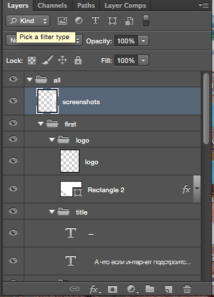

- использование групп. Слои можно объединять в группы (папки). Так же можно использовать цветовое кодирование для групп: для пометки приндлежности группы к тои или иной странице (если в макете несколько страниц)

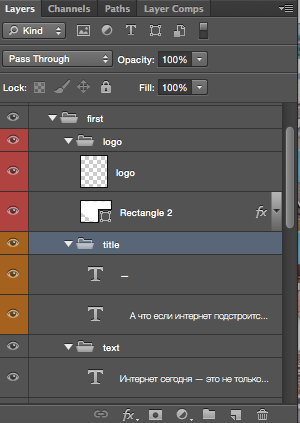

- использование Layer Comps. Этот инструмент используется для запоминания состояний. Когда в одном макете у нас находится несколько страниц, мы можем запомнить состояние включенных/выключенных слоев для каждой страницы. И потом переключаться только по сохраненным состояниям. Включить панель можно: Window -> Layer Comps.

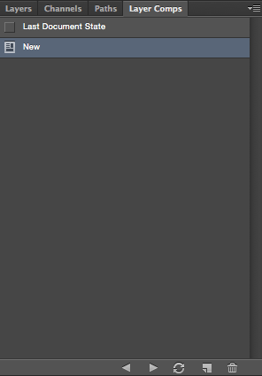

**Выбор слоёв**

Можно поискать нужный слой в панели слоёв, но есть способ быстрее.

Зажать ⌘/Ctrl и кликнуть на слой. Зажатие кнопки временно активирует инструмент `Move Tool`. Работает в случае выбора любого инструмента кроме `Hand Tool` (по зажатию Ctrl включается инструмент масштабирования) и самого `Move Tool`. Чтобы это работало, убедитесь, что настройки инструмента Move Tool (это панель под меню приложения, когда инструмент выбран) выставлены следующие: выбран Auto-Select и в выпадающем списке рядом — Layer.

**Показать и скрыть**

Показать или скрыть какие-либо слои просто — кликнуть на иконке «глаз» этого слоя в панели слоёв.

Alt + клик по иконке «глаз» в панели слоёв — показать только один этот слой, прочее скрыть, повторный клик, чтобы снова показатьв се остальные.

**Информация о слоях**

Двойной клик по миниатюре текстового слоя — редактирование слоя, выставляйте текстовой курсор в нужное место — узнаёте шрифт, размер, интерлиньяж, трансформации, кернинг, спейсинг и цвет.

Если параметры Horizontally Scale или Vertically Scale отличаются от 100%, нужно экспериментировать с CSS3-свойством transform у блока, в который включать только этот текст и налаживать взаимодействие дизайнера и верстальщика, если это контентный текст.

Двойной клик по миниатюре слоя с цветом, градиентом, заливкой текстурой — вызов модального окна с данными слоя.

Если у слоя справа есть курсивная надпись «fx» (и иконка, открывающая список), значит у него есть эффекты. Кликайте на открывающую иконку — увидите список эффектов (можно отключить их показ — кликаем на иконки глаза рядом с эффектами),

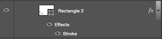

двойной клик по эффекту вызовет панель с настройками эффекта.

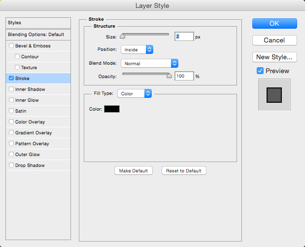

Небольшое отуступление: в верхней левой части панели слоёв есть выпадающий список — это режим наложения слоя. Если его значение отличается от Normal, то опять налаживаем взаимодействие дизайнера и верстальщика, так как слои, имеющие наложение в режиме отличном от Normal и не являющиеся часть сложных коллажей/картинок (целиком сохранаются в единое изображение), сверстать корректно (как в макете), или нереально вовсе, или требует дополнительных трудозатрат с вашей стороны.

Цвет в макете: инструмент `Euedropper Tool`    (в настройках указать Sample Size → Point Sample). Кликаем по произвольному пикселю, в панели цвета (под всеми инструментами) видим цвет пикселя.

Размер в макете: инструмент `Ruler Tool` — нажать, тащить мышью, отпустить — в панели настроек (под меню приложения, параметр L1) увидите измеренное расстояние. Если тащить с зажатым Shift, измеритель перемещается строго горизонтально, строго вертикально или под 45° (для верстальщика не актуально).

Можно использовать `Rectangle Marquee Tool`, создавая выделение (размер выделения будет показан рядом с выделением и в панели `Info`). Убрать получившееся после измерения выделение — ⌘/Ctrl + D.

Для кадрирования используйте инструмент `Rectangle Marquee Tool`, выделив им нужную область на рисунке. Выберете из меню приложения "Image" -> "Crop". Для сохранения воспользуйтесь меню "File" -> "Save"/"Save as...".

### Сохранение графики

Для сохрарения графики для веба в Photoshop праивильным будет использовать специально созданный для этого инструемент - "Safe for Web" (горячие клавиши: ⌘/Ctrl+Alt+Shift+S или через меню "File" -> "Save for Web...").

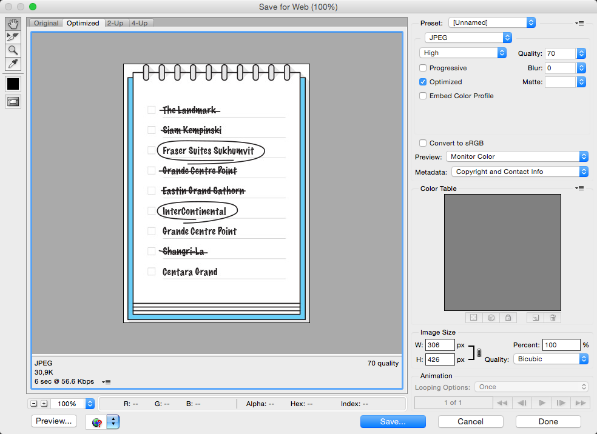

В левом верхнем углу области предварительного просмотра вы увидите серию из четырех вкладок. По умолчанию, выбрана вкладка "Оптимизация" (Optimized), которая означает, что вы не видите исходное изображение. Вместо этого, показан предварительный просмотр того, как изображение выглядит с текущими настройками оптимизации.

С правой стороны диалогового окна находятся опции оптимизации изображения.

Первое, что нужно сделать, это выбрать правильный формат файла для изображения.

- Большие фотографические (многоцветные) изображения лучше сохранять в JPEG.
- Любые картинки где нужна полупрозрачность или отсутствие искажений — PNG-24.

Далее для необходимого нам формата задаем следующие настройки:

для JPEG:
- включить отимизацию (Optimized),
- задать необходимое качество сжатия (от 60 до 95)

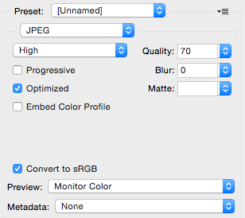

для PNG-24:
- выбираем пункт "Прозрачность" (Transparency)

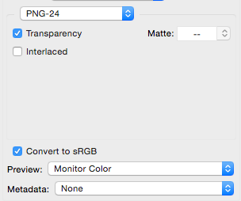

Для изображений любого формата:
- отключаем метаданные (Metadata), если в них нет необходимости - это позволит уменьшить размер изображения;
- включить опцию "Преобразовать в sRGB" (Convert to sRGB), если она ещё неактивна. Это позволит убедиться в том, что картинка сохраняется в цветовом пространстве sRGB

Подробнее о настройках оптимизации в [Save for Web](http://web.ixit.ru/photoshop/tutorials/save-for-web.shtml).

### О чем подумать при работе с макетом

- О структуре будущей верстки
- О деградации (для более старых браузеров)
- О шрифтах, используемых в макете
- О реальных данных (если в макете использована "рыба")

## Сравнение результата

В идеале, если наложить “картинку” сверстанной html-страницы на картинку оригинального PSD-макета, то обе картинки должны совпасть. Совместиться должны все элементы картинок - текст, изображения, графические элементы.

Такая техника врестки имеет специальное название: Pixel Perfect. Реализация этой техники осуществляется при помощи соответствующих плагинов под браузеры или же с помощью специализированных скриптов.

**Pixel Perfect под Firefox**

Для браузера Firefox имеется плагин Pixel Perfect для одноименной проверки сверстанной страницы.

После установки плагина Pixel Perfect его значок появиться в панели инструментов браузера Firefox.

Теперь нужно открыть в Photoshop оригинальный PSD-макет и сохранить его целиком как изображение в формате .png через “Save for Web…”.

Перед экспортом в PNG-изображение PSD-макет необходимо привести к оригинальному размеру. Для этого в Photoshop зарезервирована комбинация hotkeys: Ctrl+1 - под Windows\Linux, Cmd+1 - под Mac OS X.

Как только PNG-копия подготовлена и сохранена, открываем в окне браузера Firefox сверстанную по этому макету HTML-страницу.

Запускаем плагин Pixel Perfect щелчком мыши по его иконке в панели инструментов браузера. Сразу же появится окно плагина, в котором он предложит нам выбрать PNG-изображение:

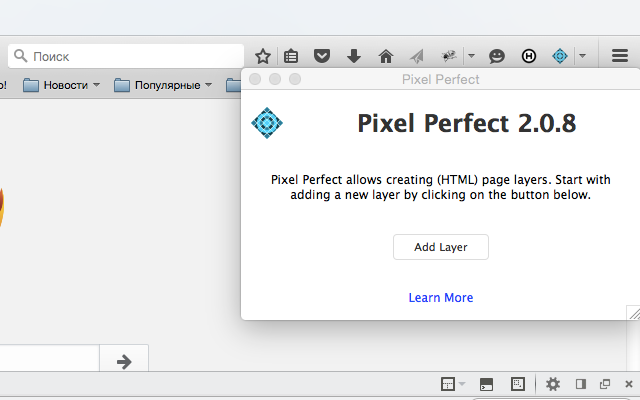

Жмем на кнопку “Add Layer”, выбираем подготовленное PNG-изображение и получаем результат - наложение двух слоев (сверстанного и оригинального):

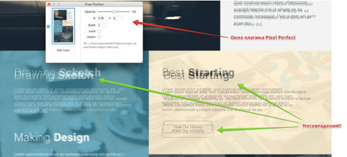

## Background

[Спецификация](http://www.w3.org/TR/css3-background/)

Background позволяет задавать цвет фона для элемента. Css-свойство background объединяет в себе пять свойств, которые используются для определения фона страницы. Это:
- `background-color` - цвет используемого фона;
- `background-image` - используемое изображение фона;
- `background-repeat` - как повторять фоновое изображение;
- `background-attachment` - является ли фоновое изображение фиксированным или прокручивается вместе со страницей;
- `background-position` - позицию фонового изображения.

```
.box {
    background: url(image.png) 50% 10% / 50px 80px no-repeat #290;
}
```

Значения в свойстве `background` могут идти в любом порядке, браузер сам определит, какое из них соответствует нужному свойству.

```
.box {
    background-image: url(yandex.png);
}
```

В приведенном выше примере элемент с классом `box` будет иметь фон - картинку `yandex.png`. Но, если картинка будет равна 250х250, а содежащий блок - 200x200, то возникнет такая ситуация:


Чтобы избежать ее, необходимо использовать дополнительное свойство - `background-size`.

```
.box {
    background-image: url(yandex.png);
    /*background-size: 100% auto;*/
    background-size: 100%;
}
```


Допустимые значения для параметра `background-size`:
- можно задавать размер в любых доступных для CSS единицах — пикселы (px), сантиметры (cm), em и др.
- можно задать размер фоновой картинки в процентах от ширины или высоты элемента.
- `auto` - если задано одновременно для ширины и высоты (auto auto), размеры фона остаются исходными; если только для одной стороны картинки (100px auto), то размер вычисляется автоматически исходя из пропорций картинки.
- `cover` - масштабирует изображение с сохранением пропорций так, чтобы его ширина или высота равнялась ширине или высоте блока.
- `contain` - масштабирует изображение с сохранением пропорций таким образом, чтобы картинка целиком поместилась внутрь блока.

Используя параметр `background-repeat`, можно установить повторение фонового изображения: только по горизонтали, по вертикали или в обе стороны.

```
.box-0 {
    background-repeat: repeat; /*по умолчанию*/
}
.box1 {
    background-repeat: no-repeat;
}
.box2 {
    background-repeat: repeat-x;
}
.box3 {
    background-repeat: repeat-y;
}
```

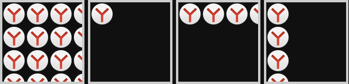


Используя свойство `background-position`, можно задать положение фоновой картинки.

```
.box {background-image: url(yandex.png);
    background-size: 30%;
    /*left | center | right | <проценты> | <значение>*/
    /*top | center | bottom | <проценты> | <значение>*/
    background-position: 75% 50%;
}
```

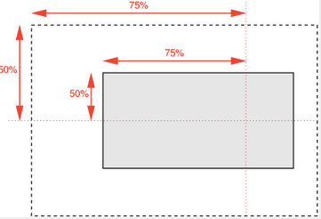

Устанавливать фоном для блока можно не только картинку или цвет, но и градиент:

```
.box {
    background: linear-gradient(to right, #ff3236 0%,#7db9e8 100%);
}
```


## Спрайты

Один из способов оптимизации - CSS-спрайт. Это прием, позволяющий объединить много изображений в одно, что помогает:

- сократить количество обращений к серверу;
- загрузить несколько изображений сразу, включая те, которые понадобятся в будущем;
- если у изображений сходная палитра, то объединённое изображение будет меньше по размеру, чем совокупность исходных картинок.

При этом изображение вставляется на страницу через css-свойство `backgound`, а не через элемент `img`. [Подробнее про использование css-спрайта](https://learn.javascript.ru/css-sprite).

Суть css-спрайта в том, что мы задаем элемент фиксированного размера и сдвигаем его `backgound` ровно на ту величину, пока не станет видно нужную картинку. Так, как в примере ниже:


```
.icon {
  width: 16px;
  height: 16px;
  float: left;
  background: url(icons.gif) no-repeat;
}

.open .icon {
  background-position: 0 -16px; /* вверх на 16px */
  cursor: pointer;
}

.closed .icon {
  background-position: 0 0px; /* по умолчанию */
  cursor: pointer;
}

.leaf .icon {
  background-position: 0 -32px; /* вверх на 32px */
  cursor: text;
}
```

Спрайтом также называют картинку, состоящую из объединенных. Чаще всего в спрайты объединяют иконки и другие мелкие изображения.

Для создания спрайта из имеющихся картинок можно воспользоваться различными онлайн-сервисами. Например:
- [Stitches](https://draeton.github.io/stitches/)
- [SpritePad](http://spritepad.wearekiss.com/)

## Base64

Еще один из способов оптимизации - использование Base64. Base64 - это способ вставить картинку прямо в веб-страницу, без обращений к внешним файлам. Все такие "встроенные" изображения используют схему data:URI.

Синтаксис у data:URL следующий:

`data:[<тип данных>][;base64],<данные>`

В случае простых изображений вам нужно указать mime-тип для них (например, image/gif), за ним идет base64-представление бинарного файла с изображением.

```

```

Такие изображения, внедренные в HTML-страницы, не кешируются для повторного использования, и они не кешируются от странице к странице (они будут кешироваться только с HTML, их содержащим). Однако, CSS кешируется браузерами, и такие изображения могут быть повторно использованы вместе с использующим их селектором, например:

```
ul > li {
    margin:0 0 .1em;
    background:url(data:image/gif;base64,R0lGODlhEAAOALMAAOazToeHh0tLS/7LZv/0j
    vb29t/f3//Ub//ge8WSLf/rhf/3kdbW1mxsbP//mf///yH5BAAAAAAALAAAAAAQAA4AAARe8L1
    Ekyky67QZ1hLnjM5UUde0ECwLJoExKcppV0aCcGCmTIHEIUEqjgaORCMxIC6e0CcguWw6aFjsV
    MkkIr7g77ZKPJjPZqIyd7sJAgVGoEGv2xsBxqNgYPj/gAwXEQA7) top left no-repeat;
    height:14px;
    text-indent:1.5em;
}
```

Но отсюда получается и главное неудобство использования base64 в css: вам нужно пересчитывать base64-представление изображений и редактировать CSS-файл каждый раз, когда само изображением меняется.

## Ссылки

[Спецификация SVG](http://www.w3.org/TR/SVG11/)
[Про SVG в MDN](https://developer.mozilla.org/ru/docs/Web/SVG)

[Спецификация Background](http://www.w3.org/TR/css3-background/)

[Работа с изображениями](http://www.artlebedev.ru/tools/technogrette/img/)

[Фотошоп для верстальщика](https://htmlacademy.ru/blog/51)

## Презентации

[Вадим Макеев 'Возвращение ножа и паровоза. Работа с веб графикой'](https://www.youtube.com/watch?v=F77mOIpeUSk)

[Павел Худяков 'Работа с макетом'](https://events.yandex.ru/lib/talks/1498/)


